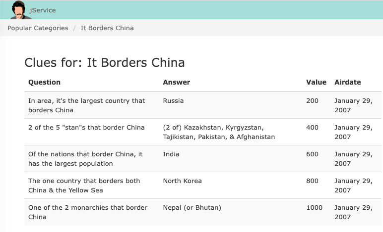
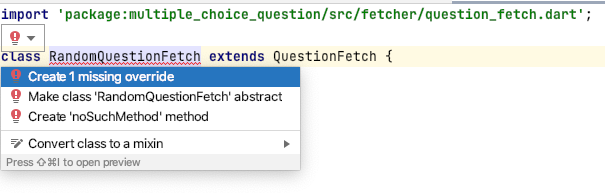

[](https://classroom.github.com/a/l9RRBPkm)
## Lab 3 - Generating Multiple Choice questions

### Before you begin

**Required Reading**:

This lab uses some concepts we haven't yet covered in class. Namely making an http request and parsing json. But dart has libraries that make talking to the internet and parsing the data you get back fairly easy - (using these libraries involves coding skills we have already discussed in class).

Before starting this lab please take a minute to read the official Flutter documentation cookbook on fetching data from the internet:

https://docs.flutter.dev/cookbook/networking/fetch-data

If you aren't familiar with technical cookbooks, they give a concise (no theory) step-by-step instructions to achieve a specific task (in this case how to get internet data).

Secondly you should browse the jService API website to gain a small amount of familiarity with this database that serves up Jeopardy TV show quiz questions through an internet application programming interface (API).

https://jservice.io/

It is from this API of actual Jeopardy TV game show `clues` that we will form our multiple choice questions.

Additionally, a cursory understanding of the Jeopardy TV gameshow may help understand how we will piece this data together into our own multiple choice questions. In Jeopardy they have categories and in each category they have multiple clues. Each clue has a question and answer and contestants try to get these clues correct to accumulate money. A sample Jeopardy game:

https://www.youtube.com/watch?v=sDcGsZK6H68&ab_channel=KSAProbasi

Lastly, before beginning this lab you should have some understanding of what we want to do ... an understanding of the big picture.

**Big Picture Overview**:

So far (from Lab02) we have a `MCQuestion` class that can represent multiple choice questions, such as:

```Courier
category: it borders china
question: Of the nations that border China, it has the largest population

choices: North Korea
choices: Russia
choices: India
choices: Nepal (or Bhutan)

correct index 2
```

The above question comes from manipulating **clues** from the actual jeopardy show from January 29, 2007 for the category **It borders China**:
https://jservice.io/popular/10537



Our **Winning Streak** app is going to retrieve a set of clues for a specific category on Jeopardy (from the jservice API) and we will manipulate those clues to form a MCQuestion object.

Essentially we will just pick a random clue from a specific jeopardy category and use its question as the question text for our MCQuestion and its answer as one of our choices. Next we fill out the remaining choices from other clues in that same jeopardy category.

Using a bit of randomness we will essentially be able to create unlimited questions in this manner for our **Winning Streak** app.

In the above example question we choose the clue with value 600 to form our MCQuestion question text and one of our choices (the correct index one). Then we fill out the remaining MCQuestion choices from other clues in this jeopardy category.

***end of required pre-lab reading***

Once you have read the cookbook and took a minute to check out jService.io, familiarized yourself with Jeopardy, and gained a big picture understanding of what we are going to do for our Winning Streak app then you can proceed with the lab.

### Lab 3 Start

In this lab we'll continue with our Dart package for Multiple Choice Questions. Today we are going to add Random Question Fetching from the jService internet API. This will involve some classes to help parse the json data we receive and convert it to a MCQuestion object.


### Task 1: Set-up

If we continue to put all of our classes into the `src` directory we are quickly going to get overloaded with files. As our apps become larger we will need to separate the files into folders. Often these folders correlate with how our app might be designed and managed (more on this later).


For today let's put our code in a subdirectory  called fetcher (`src/fetcher`). This is where our classes relating to fetching data will reside.

- Right-click on the `src` directory and select *New->Directory*
- Specify *fetcher* as the name.
- Right-click on the *fetcher* directory and select *New->Dart File*
- Specify category.dart as the file name


### Task 2: Category and Clue classes

We can access all of the clues in a given jeopardy category with a single call to the jService API:

http://jservice.io/api/category?id=X (where X is an int between 0 and 18418)

example:
https://jservice.io/api/category?id=10537

The above will return a messy looking json string. But it is somewhat readable if we use better formatting it looks like a Map or dictionary with key : value pairs (made readable using: https://jsonformatter.curiousconcept.com/):

```JSON
{
   "id":10537,
   "title":"it borders china",
   "clues_count":5,
   "clues":[
      {
         "id":80284,
         "answer":"Russia",
         "question":"In area, it's the largest country that borders China",
         "value":200,
         "airdate":"2007-01-29T12:00:00.000Z",
         "category_id":10537,
         "game_id":null,
         "invalid_count":null
      },
      {
         "id":80290,
         "answer":"(2 of) Kazakhstan, Kyrgyzstan, Tajikistan, Pakistan, \u0026 Afghanistan",
         "question":"2 of the 5 \"stan\"s that border China",
         "value":400,
         "airdate":"2007-01-29T12:00:00.000Z",
         "category_id":10537,
         "game_id":null,
         "invalid_count":null
      },
      {
         "id":80296,
         "answer":"India",
         "question":"Of the nations that border China, it has the largest population",
         "value":600,
         "airdate":"2007-01-29T12:00:00.000Z",
         "category_id":10537,
         "game_id":null,
         "invalid_count":null
      },
      {
         "id":80302,
         "answer":"North Korea",
         "question":"The one country that borders both China \u0026 the Yellow Sea",
         "value":800,
         "airdate":"2007-01-29T12:00:00.000Z",
         "category_id":10537,
         "game_id":null,
         "invalid_count":null
      },
      {
         "id":80308,
         "answer":"Nepal (or Bhutan)",
         "question":"One of the 2 monarchies that border China",
         "value":1000,
         "airdate":"2007-01-29T12:00:00.000Z",
         "category_id":10537,
         "game_id":null,
         "invalid_count":null
      }
   ]
}
```

Examining the above we see the 'top' level json object contains the following `keys` (followed with their coorsponding values):

- id
- title \*
- clues_count
- clues [ (array of more json objects) ] \*
  - each of those clues contains:
    - id
    - answer \*
    - question \*
    - value
    - airdate
    - category_id
    - game_id
    - invalid_count

Notice there are asterisks placed next to fields above that we might need to form a `MCQuestion` object.

Converting JSON into a dart class is fairly easy in Dart. Today we will follow the Flutter cookbook and do it *manually*.

*There are also libraries that will generate a dart class and convert json automatically into objects of that class for you. But for today our task isn't too hard to do manually.*

Dart provides a library called convert which contains a method `jsonDecode` that converts a json string (like the above) into a `Map<String, dynamic>` giving you access to those json key : value pairs.

This allows us to do the following (assuming the same raw json string from above):

```Dart
  Map<String, dynamic> jsonMap = jsonDecode(rawJsonString);
  String str = jsonMap['title'] as String;
  print(str); // "it borders china"
```
We will create two classes to help parse this json: `Category` and `Clue` and then we will use those classes to create a `MCQuestion` object.


**create the Clue class**

Within `fetcher/category.dart` declare a class called Clue:

```Dart
class Clue {


}
```

Clue is going to contain the attributes we need from the individual entries in the json array 'clues'. For example the entries below with (added) asterisks are what we need:
```json

{
   "id":80296,
   "answer":"India",*
   "question":"Of the nations that border China, it has the largest population",*
   "value":600,
   "airdate":"2007-01-29T12:00:00.000Z",
   "category_id":10537,
   "game_id":null,
   "invalid_count":null
},

```

Clue will have two public final instance fields an initializer formal and a factory method called `factory Clue.fromJSON`:

```Dart
class Clue {
  final String answer;
  final String question;

  Clue( {
      required this.answer,
      required this.question
  });

  factory Clue.fromJSON(Map<String, dynamic> json ) {

    //check for errors

    //construct and return a Clue object

  }
}
```
Notice `fromJSON` takes as input a Map<String, dynamic>. This method takes the result of calling jsonDecode on an individual entry in the 'clues' json array (as shown above).

**Complete the `fromJSON` method**


<details><summary>Hint 1</summary>
<p>

- manually parsing json is very error prone
  - we want to make sure that the Map contains the two keys we need:
      - "answer" and "question"
      - if not then we should throw an FormatException("invalid json")
      - `.containsKey` is a useful method
</p>
</details>
<br>

<details><summary>Hint 2</summary>
<p>

- Recall you can use the access operator [ ] to retrieve the value for a given key
  - `json['answer'] as String` //returns the String "India" for example
</p>
</details>
<br>

<details><summary>possible Clue class solution</summary>
<p>

```Dart
class Clue {
  final String answer;
  final String question;

  Clue( {
      required this.answer,
      required this.question
  });

  factory Clue.fromJSON(Map<String, dynamic> json ) {

    if (!json.containsKey('answer') ||
        !json.containsKey('question') ){
      throw FormatException("invalid json");
    }

    return Clue(
      answer:json['answer'] as String,
      question:json['question'] as String
    );
  }
}

@override
  bool operator ==(Object o) {
    if (identical(this, o)) return true;

    if (o is Clue) {
      Clue c = o as Clue;
      return c.answer == answer && c.question == question;
    }

    return false;
  }

  @override
  int get hashCode => answer.hashCode ^ question.hashCode;
```

</p>
</details>
<br>


### Task 3 Complete the Category class

Also inside category.dart define a class Category with three instance fields:

```dart

class Category {
    final String categoryTitle;
    final int count;
    final List<Clue> clues;

    //...
}
```

**Step 1:** Define the initializer formal (constructor)

<details><summary>Hint</summary>
<p>

It should look almost the same as the Clue class

</p>
</details>
<br>

**Step 2:** Define the `fromJSON` factory method:

<details><summary>Hint</summary>
<p>

```Dart
factory Category.fromJSON(Map<String, dynamic> json) {

```
</p>
</details>
<br>

**Step 3:** Throw `FormatException` in `fromJSON`:

If any of 'clues_count', 'clues' or 'title' are missing from the map throw
an FormatException

**Step 4:** retrieve the values associated with the 'clues' json array:

This is the trickiest part. The value associated with json['clues'] is a `List<dynamic>`, a dynamic can hold any type. By the time we have gotten inside the fromJSON method, someone else has already called jsonDecode on the whole raw json string. jsonDecode method will have recursively decoded our json array objects (the clues).

Therefore this List<dynamic> will actually have Map<String, dynamic> objects inside it. **These objects are decoded json clues** - and we have a method `fromJSON` in the Clue class that can convert them into Clue dart objects!


<details><summary>Note</summary>
<p>

*Note: This is where parsing json can be problematic* since it's possible the jService API changes or maybe we misread the json and how it is formatted. So we should always type check when possible.
</p>
</details>
<br>

Once we realize that `json['clues']` is a `List<dynamic>` where the real type of the objects in the List is: `Map<String, dynamic>`. Then iterating over the List and converting each item into a Clue object starts to make sense:

```dart

//get the array
List<dynamic> jsonClues = json['clues'];

//convert each to a Clue
for (var jsonClue in jsonClues) {
      Clue clue = Clue.fromJSON(jsonClue as Map<String, dynamic>));
}
```

Fix up the above code so that it builds up a `List<Clue>` that can be passed to the Category constructor. Don't forget to do error checking on the types so those casts don't turn into runtime fails.


<details><summary>Solution</summary>
<p>

```dart
List<Clue> parsedClues = <Clue>[];
List<dynamic> jsonClues = json['clues'];

for (var clue in jsonClues) {
  if (! (clue is Map<String, dynamic>) ) {
    throw FormatException("Error parsing clues from json");
  }
  parsedClues.add(Clue.fromJSON(clue as Map<String, dynamic>));
}

```

</p>
</details>
<br>

**Step 5:** Complete the `fromJSON` method in Category class:

- get the categoryTitle
- get the count
- pass these to the Category constructor
- return a Category object

<details><summary>Solution</summary>
<p>

```dart
///generate a Category from the results of a jService category api call
factory Category.fromJSON(Map<String, dynamic> json) {

  if (!json.containsKey('clues_count') ||
      !json.containsKey('clues') ||
      !json.containsKey('title') ) {
    throw FormatException("invalid json");
  }
  int number = json['clues_count'] as int;

  List<dynamic> jsonClues = json['clues'];
  List<Clue> parsedClues = <Clue>[];
  for (var clue in jsonClues) {
    if (! (clue is Map<String, dynamic>) ) {
      throw FormatException("Error parsing clues from json");
    }
    parsedClues.add(Clue.fromJSON(clue as Map<String, dynamic>));
  }
  return Category(
      categoryTitle: json['title'] as String,
      count: number,
      clues: parsedClues
  );
}

```

</p>
</details>
<br>


**Step 6:** Lastly Create and Complete a `toMCQuestion` method

Category objects aren't so useful in our model, we need an MCQuestion object. Implement a `MCQuestion toMCQuestion(int numberOfChoices)` method in the Category class to convert Category objects to MCQuestions (with numberOfChoices giving the number of multiple choice options we want).

- shuffle up the clues to add randomness
- convert the clues into a List<String> with the answers (can you use `.map`?)
- return an MCQuestion object

<details><summary>Category Class Solution</summary>
<p>

```dart
import 'dart:math';

import '../../multiple_choice_question.dart';

///represent our requirements from a jService API category
class Category {

  final String categoryTitle;
  final int count;
  final List<Clue> clues;

  Category( {
    required this.categoryTitle,
    required this.count,
    required this.clues
  });

  ///generate a Category from the results of a jService category api call
  factory Category.fromJSON(Map<String, dynamic> json) {

    if (!json.containsKey('clues_count') ||
        !json.containsKey('clues') ||
        !json.containsKey('title') ) {
      throw FormatException("invalid json");
    }
    int number = json['clues_count'] as int;

    List<dynamic> jsonClues = json['clues'];
    List<Clue> parsedClues = <Clue>[];
    for (var clue in jsonClues) {
      if (! (clue is Map<String, dynamic>) ) {
        throw FormatException("Error parsing clues from json");
      }
      parsedClues.add(Clue.fromJSON(clue as Map<String, dynamic>));
    }
    return Category(
        categoryTitle: json['title'] as String,
        count: number,
        clues: parsedClues
    );
  }

  ///convert a category to a MCQuestion object
  MCQuestion toMCQuestion(int numberOfChoices) {

    if (clues.length < numberOfChoices) {
      throw RangeError.index(numberOfChoices, clues);
    }

    //random shuffle the list of clues
    clues.shuffle();

    //random correct answer:
    int correctIndex = Random().nextInt(numberOfChoices);
    String questionText = clues[correctIndex].question;

    List<String> choices = clues.sublist(0, numberOfChoices)
                                .map((clue)=>clue.answer)
                                .toList();

    return MCQuestion(categoryTitle,questionText, choices, correctIndex);

  }

}
```

</p>
</details>
<br>

*completed Task 3: category.dart*

## Task 4: QuestionFetch Hierarchy

We now have the capability to convert decoded json strings from the jService API into MCQuestion objects.

We need some infrastructure for getting the json string from jService.
Start by defining an abstract class called QuestionFetch with 1 abstract method:

```Dart
import '../mc_question.dart';

abstract class QuestionFetch {
  Future<MCQuestion> fetch();
}
```

Place this code into a new file: `src/fetcher/question_fetch.dart`

This class has a single method that promises to return a `MCQuestion` object at some point in the future. Because this class is dependant on MCQuestion we have to import it.

We use a `Future<MCQuestion>` because classes that override this method may operate asynchronously to fetch the question (specifically when we call out to the jService API - but also if we happened to look a question up in a data base for example).

*completed task 4*

## Task 5: RandomQuestionFetch

Create another new dart file: `src/fetcher/random_question_fetch.dart` and in this file create a class `RandomQuestionFetch extends QuestionFetch`. Ensure the file in which `QuestionFetch` resides is imported properly.

You should notice that Android Studio underlines RandomQuestionFetch and if you put your cursor over the red underline you should have the option of have android studio automatically create the missing abstract method for us.



Your code should look like this:

```dart
import 'package:multiple_choice_question/src/fetcher/question_fetch.dart';
import 'package:multiple_choice_question/src/mc_question.dart';

class RandomQuestionFetch extends QuestionFetch {

  @override
  Future<MCQuestion> fetch() {
    // TODO: implement fetch
    throw UnimplementedError();
  }
}

```

- Add a final String variable to the class to store the URL for the jService API call we will make:

```dart
final String _uri = "https://jservice.io/api/category?id=";
```

- We want the `fetch()` method to run asynchronously so mark it as `async`:
```Dart
@override
Future<Question> fetch() async {
```

- We are going to be using the http package to call out to the API so we need to add it to our project. Open `pubspec.yaml` and add the following:

```yaml
dependencies:
  http: ^0.13.4
```

Click `Pub get` at the top of this file to download the http package then go back to the `random_question_fetch.dart` file.

Our code inside `fetch` will be fairly straight-forward:

- generate a random category number:
```dart
int randomCategory = Random().nextInt(18418);
```
- call out to the jService API using an HTTP get:
```Dart
//fetch json from jService
  final response = await http
      .get(Uri.parse("$_uri$randomCategory"));
```
- we use await in the above to indicate we have to wait for the http get to complete before proceeding

- if our response has status code 200 (OK) Then
  - decode the json string in `response.body` to a `Map<String, dynamic>` and then to a `Category` and then an `MCQuestion`
  - return the MCQuestion
- otherwise thrown an exception

<details><summary>Random Question Fetch Class</summary>
<p>

```dart
import 'dart:convert';
import 'dart:math';

import 'package:http/http.dart' as http;
import 'package:multiple_choice_question/src/fetcher/category.dart';

import 'package:multiple_choice_question/src/fetcher/question_fetch.dart';
import 'package:multiple_choice_question/src/mc_question.dart';

class RandomQuestionFetch extends QuestionFetch {

  final String _uri = "https://jservice.io/api/category?id=";

  final int max_category = 18418;

  @override
  Future<MCQuestion> fetch() async {

    int randomCategory = Random().nextInt(max_category);

    //fetch json from jService and convert to Category
    final response = await http
        .get(Uri.parse("$_uri$randomCategory"));

    if (response.statusCode == 200) {
      //200 is the http status code for OK (it worked)
      // If the server did return a 200 OK response,
      // then parse the JSON.

      var category = Category.fromJSON(jsonDecode(response.body));
      var question = category.toMCQuestion(4);

      return question;
    } else {
      // If the server did not return a 200 OK response,
      // then throw an exception.
      throw Exception('Failed to fetch question');
    }
  }
}

```

</p>
</details>
<br>

## Task 6: Example

Before you begin:
  - export the `question_fetch.dart` and `random_question_fetch.dart` dart files in `multiple_choice_question.dart`:

```Dart
library multiple_choice_question;

export 'src/multiple_choice_question_base.dart';
export 'src/mc_question.dart';
export 'src/fetcher/question_fetch.dart';
export 'src/fetcher/random_question_fetch.dart';
```

Now in the `example` directory open `multiple_choice_question_example.dart`. Delete the existing code.

We will fetch a `MCQuestion` object from the internet and print it to console. On occasion an error may occur (if the api fails for example). So we'll try this 3 times and catch specific errors that we have programmed above to be thrown. After 3 times we'll just move on.

```dart
import 'package:multiple_choice_question/multiple_choice_question.dart';

void main() async {

  late MCQuestion question;
  bool done = false;

  //try to get an MCQuestion 3 times before declaring failure
  for (int i = 0; i< 3 && !done; i++) {
    try {
      question = await RandomQuestionFetch().fetch();
      print(question);
      done = true;
    } on RangeError catch(e) {
      print(e.message);
      print("attempt: ${i+1} of 3");
    }on FormatException catch(e) {
      print(e.message);
      print("attempt: ${i+1} of 3");
    } catch(e) {
      print(e);
      print("attempt: ${i+1} of 3");
    }
  }
}
```

Notice in the above we use async and await.

What type is returned by `RandomQuestionFetch().fetch()`?

<details><summary>What type is var question</summary>
<p>

- it is a `Future<MCQuestion>`
- because we use await the return type can be assigned to `MCQuestion`
  - we know the task has completed after await and the Future can be stripped

</p>
</details>
<br>

Alter the above code to use the raw `Future` without async and await and print out the MCQuestion to console using a call to `then` and `catchError`

You may also want to check out `mcquestion_example_isolates.dart` to see how to execute a question fetch using multiple isolates. Note: This is just for curiosity - Flutter has a different mechanism for managing isolates than raw dart code.

##Improvements

One obvious improvement is to fix the text formatting of the responses from jService. `<i>`, `</i>`, `\'` and others can all be stripped out.

A second and perhaps more challenging improvement is to get rid of duplicate answers. This could cause some exceptions to be thrown when there are not enough choices. But this would make a huge improvement to our eventual quiz game.

a third improvement is to augment the MCQuestion class so that we override the == operator and the hash


*End of Lab*
