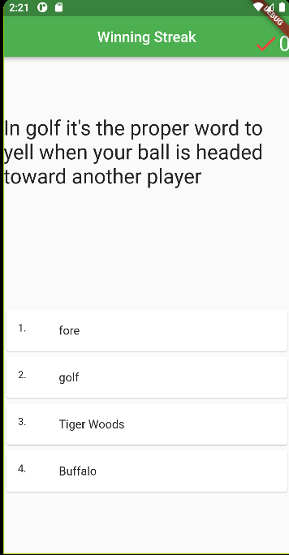
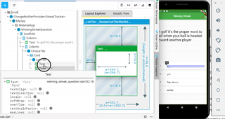
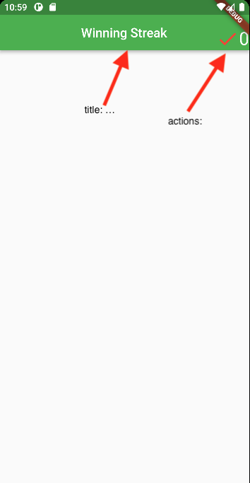
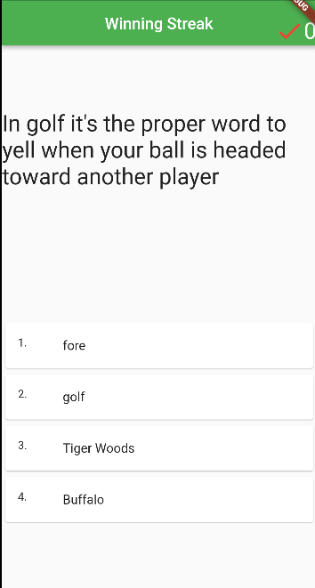

# Building a UI with State Management

In this lab we will build a UI for our Winning Streak App and discuss state management for tracking a streak of correct answers in a row.

We will build an app with a single screen that looks like this:



Our UI design will contain a Scaffold that contains the AppBar (at the top). The AppBar will have the title, and in the action items (top right) an Icon and counter for counting the streak of correct answers in a row. In the body of the Scaffold are two Columns, the first containing two cells with the question text in the first cell and another Column in the second. The second Column contains 4 Cards each with a ListTile and their choice (Text) (they will be clickable).



Users will be able to tap any of the question answers and if they choose the correct answer their streak will increase by 1 (shown via a counter in the top right). If they choose an incorrect answer their streak will reset to 0.

The app isn't particularly interesting since it is a single screen with static content (the question never changes). However it should be possible to see where our app is going from here.

We will build the app twice. Once using a StatefulWidget which will host the streak counter directly in the State for the Widget. The second time we will elevate the state out of the Widget (creating a model) and use the Provider package to manage state.

Let's get started.


## Prerequisites:

- Familiar with [Flutter Basic Widgets](https://docs.flutter.dev/development/ui/widgets/basics)

- Required Reading: [flutter simple state management](https://docs.flutter.dev/development/data-and-backend/state-mgmt/simple)


## Getting started

In android studio create a new flutter project called `winning_streak_lab04`

Add a source folder called `screens` (under the `lib` directory) and in that folder create a file named `winning_streak_question.dart`

This file is where we will design our screen that shows the above design.

### Create WinningStreakQuestion class as a StatefulWidget

In `winning_streak_question.dart` define a class `WinningStreakQuestion extends StatefulWidget` and `_WinningStreakState extends State<WinningStreakQuestion>`. We will create this as a stateful widget because we are going to track directly in the screen class the number of times in a row a user taps the correct answer.

*Note: As we develop the app this way - you should pay attention to how it couples the business logic (tracking a winning streak) with the UI (the items that show on screen). Coupling these two things in something we will try to avoid (generally), we do it here as a demonstration.*

Your code should look something like this:

```Dart
import 'package:flutter/material.dart';

///screen where a question is displayed for the user to answer
class WinningStreakQuestion extends StatefulWidget {

  const WinningStreakQuestion();

  @override
  _WinningStreakState createState() => _WinningStreakState();
}

class _WinningStreakState extends State<WinningStreakQuestion> {


  @override
  Widget build(BuildContext context) {
    // TODO: implement build
    throw UnimplementedError();
  }
}

```

## Track streaks of correct answers with setState

In flutter with a `StatefulWidget` you can call `setState` to notify the framework that the state of this widget has changed (and should be scheduled to be rebuilt). `setState` takes as input a void method which you can define to update any variables that are required to correctly build the Widget so it displays the correct state information.

[As the Flutter API says:](https://api.flutter.dev/flutter/widgets/State/setState.html) `Whenever you change the internal state of a State object, make the change in a function that you pass to setState:` Example:
```Dart
setState(() { _myState = newValue; });
```

It is potentially very costly to rebuild a Widget (and its entire subtree)  via setState. So in real-world settings we wouldn't necessarily use this type of solution. But for this lab it will be our starting point.

- Add an integer variable to the WinningStreakState class to track the number of questions correctly answered in a row - initialize it to zero.

- Add a method that increments the streak variable and a method that resets it to zero (when an incorrect answer is given). These methods should call `setState` and pass an anonymous method that either increments or zeroes the counter as a parameter to `setState`.


Example anonymous method that increments an int variable:
`()=>_streak++`


<details><summary>Hint: _streak variable and methods</summary>
<p>

```dart
int _streak = 0;

void increment() {
  setState( ()=>_streak++);
}

void reset() {
  setState( ()=>_streak=0);
}

```
</p>
</details>
<br>


## Implement the UI Widgets

### Create a Scaffold with AppBar

In this section we will update the `_WinningStreakState` build method to display our UI. The UI will contain first a `Scaffold` (this gets returned from the build method). A Scaffold implements many common application layout structure widget, our app will use this as the base Widget.

We will place the counter displaying the current winning streak in the `AppBar` along with a page title: `Winning Streak`.

Use the code completion features of Android Studio to help with your coding.

1. Return a `Scaffold` and set the appBar: named parameter to be an AppBar object within the build method of `_WinningStreakState`.

Your code might look something like this at this point:

```Dart
return Scaffold(
        appBar: AppBar(

```

 1. Set the AppBar so that it displays a title (`named parameter passed to AppBar called title:`) which is a Text Widget
 2. Set the `actions:` for the AppBar. **Actions** are the icons and text that typically display in the top right of an app bar. Actions expects an array of Widgets: `actions: <Widget>[...]`

 In our case we will display an `Icon` followed by a Text giving the length of the current `$_streak`
  - you can adjust the positioning slightly using an Align Widget, which takes a single `child:` parameter. Meaning you could wrap the Icon and Text into a Row and pass that as the child to Align and get the Icon and Text to show below the `debug` stripe using Alignment.bottomRight.
  - mostly the important thing is to get something you like the look of.

  - Pick an Icon you think represents a correct answer or a winning streak. My choice was: `Icon(Icons.check_rounded)` and then you can adjust the `color:` and `size:`.


### Build the app:

Open main.dart and replace the boiler plate code so it displays your app:

```Dart
import 'package:flutter/material.dart';
import 'screens/winning_streak_question.dart';

void main() {
  runApp(const MyApp());
}

class MyApp extends StatelessWidget {
  const MyApp({Key? key}) : super(key: key);
  // This widget is the root of your application.
  @override
  Widget build(BuildContext context) {
    return MaterialApp(
      title: 'Flutter Demo',
      theme: ThemeData(
        primarySwatch: Colors.green,
      ),
      home: const WinningStreakQuestion(),
    );
  }
}
```

You should see something similar to this:




<details><summary>Hint: AppBar title</summary>
<p>

```dart
return Scaffold(
        appBar: AppBar(
            centerTitle: true,
            title: Text("Winning Streak"),

```
</p>
</details>
<br>

<details><summary>Hint: AppBar full</summary>
<p>

```dart
return Scaffold(
        appBar: AppBar(
            centerTitle: true,
            title: Text("Winning Streak"),
            actions: <Widget>[
            Align(
              alignment:Alignment.bottomRight,
              child: Row(
                children: <Widget>[
                  const Icon(Icons.check_rounded,
                      color:Colors.red,
                      size:36.0),
                  Text("$_streak",
                  textScaleFactor: 2.0,),
                ]
              ),
            ),

          ]
        ),
    );
```
</p>
</details>
<br>

## Scaffold body

The app is displayed in the emulator. Remember you can hot reload the app by saving the file (or other methods) and see any changes very quickly in the emulator.

We are trying to get the Question to display in the top half of the screen and the choices in the bottom half:



A Simple way to do this is to use a `Column` with 2 children. Without any other modifiers the children will split over the 2 halves of the screen. The first child is a `Text` to display the question while the 2nd child is a `Column` where we'll place the choices.

- [ ] Create the `Column` with 2 children
- [ ] Make the first child a Text with the text of your Question
- [ ] Make the second child a Column


You'll want something that can listen for taps inside that Column. If you place a Text it has to be wrapped in something that can detect taps, such as an `Inkwell` or `GestureDetector`. In my solution I use a `Card` (because I like the look of them), and I store a `ListTile` in the `Card`. The `leading` named parameter for ListTile receives the number (like `1.`) and the `title` receives the prose of the choice.

The question text and choice text is all hard coded in this example.

`ListTile` is good because it gives a specific look wide across the page and handles `onTap` gestures. Add the `onTap` parameter so that it either calls into our previous `increment` or `reset` methods to set the state for the streak counter:

`onTap:increment,` Notice we can pass a method directly to onTap. Recall: methods are objects in dart.

Other options like `InkWell` or `TextButton` or `GestureDetector` are also great solutions that will give a slightly different look.


## Run the App

- Does clicking the correct answer increment the counter in the top right?

- Does clicking a wrong answer reset the counter?

<details><summary>Hint: Full winning_streak_question.dart file</summary>
<p>

```dart
import 'package:flutter/material.dart';


///screen where a question is displayed for the user to answer
class WinningStreakQuestion extends StatefulWidget {

  const WinningStreakQuestion({Key? key}) : super(key:key);

  @override
  _WinningStreakState createState() => _WinningStreakState();
}

class _WinningStreakState extends State<WinningStreakQuestion> {

  int _streak = 0;

  void increment() {
    setState( ()=>_streak++);
  }

  void reset() {
    setState( ()=>_streak=0);
  }

  @override
  Widget build(BuildContext context) {

    return Scaffold(
        appBar: AppBar(
            centerTitle: true,
            title: const Text("Winning Streak"),
            actions: <Widget>[
            Align(
              alignment:Alignment.bottomRight,
              child: Row(
                children: <Widget>[
                  const Icon(Icons.check_rounded,
                      color:Colors.red,
                      size:36.0),
                  Text("$_streak",
                  textScaleFactor: 2.0,),
                ]
              ),
            ),
          ]
        ),
        body: Column(
          mainAxisAlignment: MainAxisAlignment.spaceAround,
          crossAxisAlignment: CrossAxisAlignment.center,
          children: <Widget>[
            const Text("In golf it's the proper word to yell when your ball is headed toward another player",
                textScaleFactor: 2.0,
            ),
            Column(
                  children: [
                    Card(
                      child: ListTile(
                      leading: const Text("1."),
                      title: const Text("fore"),
                      onTap:increment,
                     ),
                    ),
                    Card(
                      child: ListTile(
                        leading: const Text("2."),
                        title: const Text("golf"),
                        onTap:reset,
                      ),
                    ),
                    Card(
                      child: ListTile(
                        leading: const Text("3."),
                        title: const Text("Tiger Woods"),
                        onTap:reset,
                      ),
                    ),
                    Card(
                      child: ListTile(
                        leading: const Text("4."),
                        title: const Text("Buffalo"),
                        onTap:reset,
                      ),
                    ),
                  ]
            )
          ],
        )
    );
  }
}


```
</p>
</details>
<br>


## Issues

So far this lab should help us understand a bit about state management. Hopefully a few questions might arise after looking at your solution so far.

1. We repeat code for the 4 choices. This can be easily parameterized into our own custom Widget class that takes as input the required text:

<details><summary>Hint: use a custom widget to improve code reuse and readability</summary>
<p>

```dart

class ChoiceTile extends StatelessWidget {
  final int option;
  final String text;
  final void Function() callBack;

  const ChoiceTile( {required this.option, required this.text, required this.callBack});

  @override
  Widget build(BuildContext context) {
    return Card(
        child: ListTile(
          leading: Text("${option}."),
          title: Text(text),
          onTap: callBack, //note we don't have direct access to _streak or increment anymore
        )
    );
  }
}

//example usage in _WinningStreakState:
ChoiceTile(
  option:1,
  text:"fore",
  callBack: increment,
)

```
</p>
</details>
<br>


Check-out this for a tutorial on why we should create a separate widget instead of a helper method (returning a Widget) to reduce repeated code:  https://www.youtube.com/watch?v=IOyq-eTRhvo&ab_channel=Flutter


2. We are required to pass those callback functions (`increment` or `reset` or an accessor for _streak) anywhere they need to be used. Consider, a new type of video question (as opposed to the text and choice screen we just developed), on a new type of screen, how does it gain access to increment or reset? Passing things around is cumbersome and adds bloat. But we have discussed in a prior class: `InheritedWidget`, which tries to solve this problem.

3. calling `setState` causes lots of rebuilding. In our example we just want to rebuild the Text in the AppBar. We don't want to rebuild the whole screen.

4. Our Business Logic (the length of the winning streak) is intertwined into a UI widget. What if we want to see if this score is a high score. We need to access the _streak variable from this widget? Make a duplicate and store it elsewhere? Should this Widget be responsible for drawing Widgets to the screen and tracking and modifying the data that should be behind the scenes?

5. How do we test this code to make sure it works? We basically skip over the simplest type of testing: unit-testing and jump right into integration testing because we have to create a widget just to test our increment and reset methods.

In the rest of the lab we will look at a better solution for state management that helps us separate business logic (tracking a winning streak) and UI components (organizing the question text and displaying the current winning streak).


## Provider Solution

Requires: [provider package](https://pub.dev/packages/provider)


Provider is a way to make Inherited Widget more manageable.

Recall, the idea behind InheritedWidget is to allow us to easily access Widgets that are high up in a hierarchy anywhere in the chain of dependencies. The provider package uses InheritedWidget widget and gives us the ability to separate our business logic into its own class and have that class notify others when the data has changed, thus allowing them to update their Widgets, etc.

In our case, we will build a model to represent a winning streak and that model will use the functionality of Provider to `notify` any widgets that are interested any time our data changes.

To use `Provider` we will:

- Create a model class called `StreakTracker` to track winning streaks
- Combine this model class with `ChangeNotifier` from the `Provider` package
  - call `notifyListeners()` to tell those interested any time that our state has changed (like inside an `increment` method for example)
- High in our Widget Tree we will create a `ChangeNotifierProvider`
  - wrap any interested Widgets in a `Consumer` to listen (and consume) those notifications we send out.
  - use `context.read<StreakTracker>` to access the methods of StreakTracker like the length of the winning streak.

### Add the Provider dependency

- add to pubspec.yaml under dependencies:

```yaml
  provider: ^6.0.2
```

Click `Pub get`

### Move the Business logic

- Add a `models` directory under lib
- create a file: `streak_tracker.dart` in the models directory

We will move the code related to tracking the length of a streak into this file.

### StreakTracker class

1. Create `class StreakTracker with ChangeNotifier {` inside `streak_tracker.dart`
  - recall the with keyword uses a mixin (declares StreakTracker will support/inherit the ChangeNotifier interface)

2. Add an `int _streak = 0;` variable and migrate the two methods `increment` and `reset` from the _WinningStreakState class and ensure they now call `notifyListeners()` before they terminate.
  - this will work like a subscription. Interested Widgets will subscribe to StreakTracker's notification and StreakTracker will notify those interested parties of changes by calling notifyListeners() allow them to update their Widgets, etc.

3. Add a getter for `_streak`


<details><summary>StreakTracker class</summary>
<p>

```dart


import 'package:flutter/material.dart';

class StreakTracker extends ChangeNotifier {

  int _streak = 0;

  void increment() {
    _streak++;
    notifyListeners();
  }

  void reset() {
    _streak = 0;
    notifyListeners();
  }

  int get streak => _streak;

}

```
</p>
</details>
<br>

### Modify the WinningStreak class to be Stateless

- WinningStreak will have all the information it needs when it is built

- extend `StatelessWidget` and then delete all the code down to the old `build` method of the previous `_WinningStreakState` class. (some minor fix-up might be required). That build method will become the build method of our new `WinningStreak extends StatelessWidget` class.

- where you previously accessed `streak` in the AppBar wrap that Text widget with a `Consumer<StreakTracker>` widget.
  - the consumer gives you access to the context, StreakTracker instance, and the child (which could be your subtree).

```dart  
Consumer<StreakTracker> (
  builder: (context, streak, child) =>
    Text("${streak.streak}", //access through the streak parameter
      textScaleFactor: 2.0,
    ),
),
```
**Note:** The `builder:` parameter is a function taking 3 parameters of its own, the current context, a reference to your `StreakTracker` object and a child representing the subtree under this widget.

We use the Consumer here because it will handle those `notifyListeners` calls from the `StreakTracker` class. In this case only the Text that is wrapped in the Consumer will be updated when `notifyListeners` is called from `StreakTracker`. That's efficient!

- where the `increment` and `reset` methods were previously called use: `context.read<StreakTracker>` to gain access to the StreakTracker object. Then you can call `.increment` or `.reset` on that object: `context.read<StreakTracker>().increment()` for example.
  - Note: Since these don't need to update anytime the winning streak updates they aren't wrapped in a `Consumer`. But they need to call out to the StreakTracker and tell it to update. They use `context.read` to do that.

<details><summary>Modified WinningSteak class</summary>
<p>

```dart

import 'package:flutter/material.dart';
import 'package:provider/provider.dart';
import 'package:winning_streak_lab04/models/streak_tracker.dart';


///screen where a question is displayed for the user to answer
class WinningStreakQuestion extends StatelessWidget {

  const WinningStreakQuestion({Key? key}) : super(key:key);

  @override
  Widget build(BuildContext context) {

    return Scaffold(
        appBar: AppBar(
            centerTitle: true,
            title: const Text("Winning Streak"),
            actions: <Widget>[
            Align(
              alignment:Alignment.bottomRight,
              child: Row(
                children: <Widget>[
                  const Icon(Icons.check_rounded,
                      color:Colors.red,
                      size:36.0),
                  Consumer<StreakTracker> (
                    builder: (context, streak, child) =>
                      Text("${streak.streak}",
                        textScaleFactor: 2.0,
                      ),
                  ),
                ]
              ),
            ),
          ]
        ),
        body: Column(
          mainAxisAlignment: MainAxisAlignment.spaceAround,
          crossAxisAlignment: CrossAxisAlignment.center,
          children: <Widget>[
            const Text("In golf it's the proper word to yell when your ball is headed toward another player",
                textScaleFactor: 2.0,
            ),
            Column(
                  children: [
                     ChoiceTile(option:1,
                    text:"fore",
                    callBack: context.read<StreakTracker>().increment,
                    ),
                     ChoiceTile(option:2,
                      text:"golf",
                      callBack: context.read<StreakTracker>().reset,
                    ),
                    ChoiceTile(option:3,
                      text:"Tiger Woods",
                      callBack: context.read<StreakTracker>().reset,
                    ),
                    ChoiceTile(option:4,
                      text:"Buffalo",
                      callBack: context.read<StreakTracker>().reset,
                    ),
                  ]
            )
          ],
        )
    );
  }
}

class ChoiceTile extends StatelessWidget {
  final int option;
  final String text;
  final void Function() callBack;

  const ChoiceTile( {required this.option, required this.text, required this.callBack});

  @override
  Widget build(BuildContext context) {
    return Card(
        child: ListTile(
          leading: Text("${option}."),
          title: Text(text),
          onTap: callBack,
        )
    );
  }
}
```
</p>
</details>
<br>

### Create the StreakTracker object

At this point our UI is now calling out to a StreakTracker object. `context.read<StreakTracker>` basically says go up the Widget hierarchy and you will find a StreakTracker object. We need to create a StreakTracker object high in the Widget Tree for all of this to work.

High up in the Widget Tree create the StreakTracker object so it will be available.

Modify main.dart to create the `StreakTracker` and attach it to MyApp:

```Dart
runApp(
      ChangeNotifierProvider(
        create: (context)=>StreakTracker(),
        child: MyApp(),
      )
  );
```

<details><summary>full main.dart file</summary>
<p>

```dart
import 'package:flutter/material.dart';
import 'package:provider/provider.dart';
import 'models/streak_tracker.dart';
import 'screens/winning_streak_question.dart';

void main() {
  runApp(
      ChangeNotifierProvider(
        create: (context)=>StreakTracker(),
        child: MyApp(),
      )
  );
}

class MyApp extends StatelessWidget {
  const MyApp({Key? key}) : super(key: key);
  // This widget is the root of your application.
  @override
  Widget build(BuildContext context) {
    return MaterialApp(
      title: 'Flutter Demo',
      theme: ThemeData(
        primarySwatch: Colors.green,
      ),
      home: const WinningStreakQuestion(),
    );
  }
}
```
</p>
</details>
<br>

## Run the App and ensure it still functions as before

At this point you have

- separated UI and business logic  
- implemented a modern state management strategy (Provider)
- built a functional UI
- created reusable code blocks
  - created a separate widget for choices
    - could separate that out further into a 4 choice block widget
  - model class for tracking the length of a winning streak
- hopefully starting to see how the end WinningStreak app will be assembled into a functioning game

**end of lab 04**
