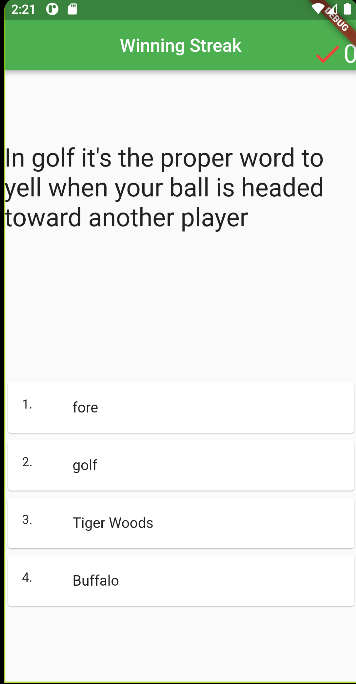
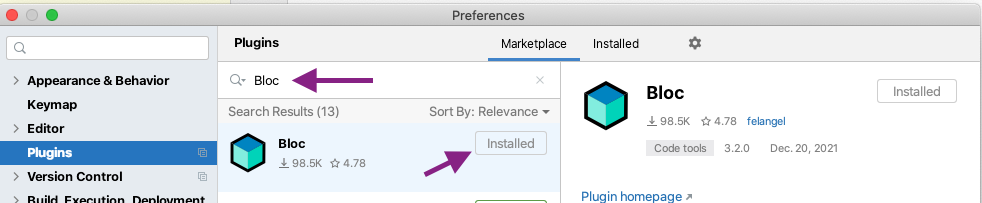
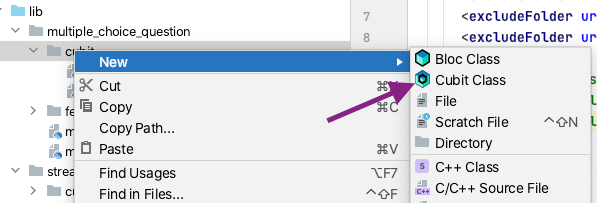
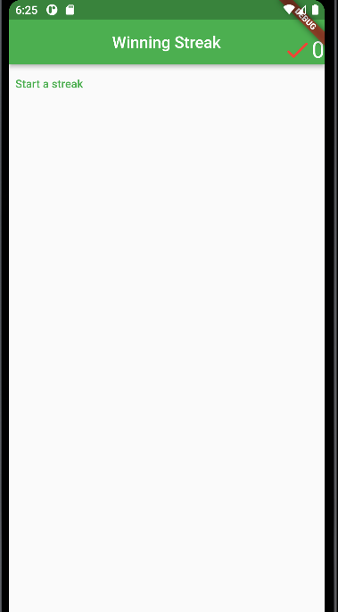
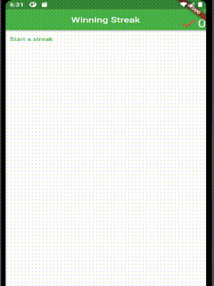
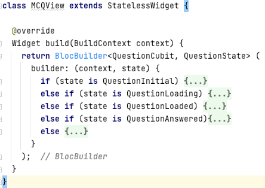
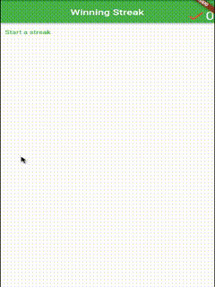

## BLoC

Business Logic Components (BLoC) is a state management pattern first introduced by Google in 2018 that uses Asynchronous streams.

Official Bloc website: [Bloc Library](https://bloclibrary.dev/#/)

## Prerequisites

Lab 04 - Introduction to State Management with StatefulWidget and provider
  - this lab provides you with some starter code from lab 04. However, the code has been reorganized.
  - you should browse the source code from the starter code to ensure you are familiar with it.

Recall from Lab 04 we had an app that looked like this:




We want to use proper statement management practices for the handling of the winning streak counter.

One such practice is the use of BLoC state management. BLoC allows us to separate our application into 3 layers:
  - Presentation
  - Business Logic
  - Data


The bloc will sit in the middle of your application, it will handle business logic. This means it responds to events sent from the UI, makes requests for data and ultimately sends state information back to the UI.

Consider our Winning Streak App:

We have a data block (our random question fetcher from lab 03) and we have some UI components from Lab 04, today we will build the middle component using a subset of the bloc library called Cubit.

We will use cubits to track two things:
- the length of a streak of correctly answered questions
- the state of multiple choice questions

You are given some starter code, which you should recognize from Lab 03 and Lab 04. However, to save time this code has been reorganized slightly from its previous rendition. Ensure you are familiar with the code before proceeding with the lab.

Don't be nervous if the starter code has a large number of files, you will gain familiarity with them as we go through the lab today.

# Build the App

- check the source code
- notice a new class: `MCQView` is now in the multiple_choice_question directory under view
- follow through from main.dart to see which files are touched

You should see something similar to what you had in Lab 04 but without any responsiveness (no clicking or tracking streak length).

# Cubit\<int\> to track streak length

Our state in lab 04 involves only a `_streak` integer variable and so it has been fairly simple. Bloc has a mechanism for handling *simple* state updates which involves using Bloc's **Cubit** API. Cubit removes a lot of the complexity of bloc and so it is a great place to start (in fact our whole lab today will use Cubit from Bloc).

This part of the lab will follow closely from the official bloc library tutorial:
[BLoC Counter Tutorial](https://bloclibrary.dev/#/fluttercountertutorial)

Notice the `bloc`, `flutter_bloc` and `bloc_test` dependencies have been added to `pubspec.yaml`:

```yaml
dependencies:
  flutter:
    sdk: flutter
  bloc: ^8.0.2
  flutter_bloc: ^8.0.1

dev_dependencies:
  bloc_test: ^9.0.2
```

Always remember to execute `pub get` whenever you add new dependencies.

You are given some starter code for this lab with the following directory structure which follows from a feature-driven directory structure (the features (e.g. streak tracking) are housed in their own directories)

```ascii
├── lib
│   ├── app.dart
│   ├── streak
│   │   ├── streak.dart
│   │   ├── cubit
│   │   │   └── streak_cubit.dart
│   │   └── view
│   │       ├── streak_page.dart
│   │       └── streak_view.dart
│   ├── streak_observer.dart
│   └── main.dart
│   │
│   └──multiple_choice_question
│       └...(some similarities to lab 3)
│   
├── pubspec.lock
├── pubspec.yaml
└
```

That may look like a lot of files but we will build each of them up into a nice BLoC managed app plus we can reuse a fair amount of code from Lab 04 too.

## What's a Cubit?

- Create a new file:
`lib/streak/cubit/streak_cubit.dart`


A cubit is a minimal subset of the BLoC pattern and within the BLoC framework, a cubit stores an observable state. It simplifies the way we manage the state of an application. While BLoC makes use of events that are passed between your UI and BLoC, a Cubit simplifies this process by replacing the events with functions in their place.

A cubit is a generic class that can be instantiated with the data type that you are wanting others to observe and react to. In our first example we want to store an integer to represent the length of a winning streak. So we will extend the `Cubit<int>` class.

Thus our StreakCubit class will look like this:
(add this code inside `lib/cubit/streak_cubit.dart`)
```dart

import 'package:bloc/bloc.dart';

/// A Cubit which manages an int as its state.
class StreakCubit extends Cubit<int> {
```

You can use the super() constructor to override the initial state of the Cubit:
```dart
StreakCubit() : super(0);
```

As before with our Provider solution we require the `increment` and `reset` methods. In this case we access the underlying data through the super class via a getter method called: `state`
  - the type for `state` is determined by the generic type `Cubit<int>` (in this case `int`)

  - to set the state use the `emit` method. `emit` **both sets and tells the consumers of this Cubit to update their states** (i.e., rebuild their UI widgets that depend on this state).

The `reset` method is as follows:

```dart
void reset() {
  //emit will set the state to 0
  //AND tell everyone to update (e.g. redraw a UI widget)
  emit(0);
}
```

- Implement the `increment` method

<details><summary>Hint: increment method</summary>
<p>

```dart
void increment() => emit(state + 1);
```
</p>
</details>
<br>


*Note: Cubits can be used on custom types e.g., `Cubit<QuestionState>`, which can be convenient as we will see later*.

## Connect the Cubit to the UI

Cubit works similarly to our previous Provider solution.

We need a BLoC provider to allow children in the widget tree to access the functionality of the BLoC. This is called a dependency injection widget so that a single instance of a bloc can be provided to multiple widgets within a subtree.

In this case we will separate the creation of the Cubit from the consumption of the Cubit. The Cubit will be consumed in the StreakView class, but it will be created in the StreakPage class. We separate these actions to help facilitate testing and code reuse.

## StreakPage (`lib/streak/view/streak_page.dart`)

The StreakPage is a simple class (StatelessWidget) that will create our StreakCubit and provide it to a view.

Edit `lib/streak/view/streak_page.dart` so that instead of returning a StreakView the build method returns a  `BlocProvider<StreakCubit>(...)` with the following items passed into the constructor:
```dart
create: (_) => StreakCubit(),
child: StreakView(),
```

You may need to import the streak_cubit.dart file:
`import 'package:lab_05/streak/cubit/streak_cubit.dart';`
(or you can export it from streak.dart)

**NOTE**: We have injected the Provider object into the Widget Tree at the level of the StreakView. Thus any Widgets that are children of StreakView have access to our `StreakCubit`

<details><summary>Hint: streak_page.dart file</summary>
<p>

```dart
import 'package:flutter/material.dart';
import 'package:flutter_bloc/flutter_bloc.dart';
import 'package:lab_05/streak/cubit/streak_cubit.dart';
import 'streak_view.dart';

/// Stateless widget responsible for providing StreakCubit to StreakView
class StreakPage extends StatelessWidget {
  /// {@macro counter_page}
  const StreakPage({Key? key}) : super(key: key);

  @override
  Widget build(BuildContext context) {
    return BlocProvider<StreakCubit>(
      create: (_)=> StreakCubit(),
      child: StreakView(),
    );
  }
}
```
</p>
</details>
<br>

Now create the streak view so that the streak is tracked in the upper right hand corner of the screen as it was in our previous lab:


Inside streak_view.dart where it says:

```Dart
//NOTHING HERE YET
//PREVIOUSLY THIS WAS A PROVIDER
//TODO: USE A BLOCBUILDER HERE TO GET THE STATE OF THE Streak
```

We will use a `BlocBuilder<StreakCubit, int>` to provide access to our `StreakCubit` within its builder: parameter. This will look similar to how we built the `Consumer` in our Provider solution. The `state` variable gives direct access to the int (from our cubit).

Place a BlocBuilder after the Icon in the AppBar so that it returns a Text object using `$state` to access the int representing the length of our streak:

```dart
BlocBuilder<StreakCubit, int>(
  builder: (context, state) {
    return Text('$state',
      textScaleFactor: 2.0,
    );
  },
),
```

Rebuilding the app should display the counter set to zero in the top right. (You may need to import streak_cubit).

## Link up the ChoiceTiles

`multiple_choice_question/view/mcq_view.dart`

In the MCQView class a callback function should be passed to our ChoiceTile (custom) StatelessWidgets.

First import flutter_bloc at the top of mcq_view.dart (if it isn't already):

`import 'package:flutter_bloc/flutter_bloc.dart';`

Then pass into the `callBack` named parameter of the 4 ChoiceTile objects the appropriate call to `increment` or `reset` for our cubit.

Access the cubit using:
`context.read<StreakCubit>()`

then call `.increment` or `.reset`

example:

```Dart
ChoiceTile(option: 1,
  text: "fore",
  callBack: context.read<StreakCubit>().increment,
),

```

<details><summary>Hint: all the callBacks added</summary>
<p>

```dart
ChoiceTile(option: 1,
  text: "fore",
  callBack: context.read<StreakCubit>().increment,
),
ChoiceTile(option: 2,
    text: "golf",
    callBack: context.read<StreakCubit>().reset,
),
ChoiceTile(option: 3,
    text: "Tiger Woods",
    callBack: context.read<StreakCubit>().reset,
),
ChoiceTile(option: 4,
    text: "Buffalo",
    callBack: context.read<StreakCubit>().reset,
),
```
</p>
</details>
<br>

- Run the application and check everything is working.


## Observe the state changes

Everything should look like it is working at the moment. However it is sometimes nice to be able to observe state changes to help debug things easier.

- Use a bloc observer to print state changes to the console

Alter main.dart as follows:

```Dart
import 'package:bloc/bloc.dart';
import 'package:flutter/widgets.dart';

import 'app.dart';
import 'streak_observer.dart';

void main() {
  //runApp(const StreakApp());
  BlocOverrides.runZoned(
        () => runApp( StreakApp()),
    blocObserver: StreakObserver(),
  );
}
```


Alter streak_observer.dart as:

```Dart
import 'package:bloc/bloc.dart';

///BlocObserver observes all state changes.
class StreakObserver extends BlocObserver {
  @override
  void onChange(BlocBase bloc, Change change) {
    super.onChange(bloc, change);
    print('${bloc.runtimeType} $change');
  }
}
```

Now any state changes being passed around our bloc will be printed out to the console. Re-run the app and observe the messages in the console output:
```ascii
I/flutter (19884): StreakCubit Change { currentState: 0, nextState: 1 }
I/flutter (19884): StreakCubit Change { currentState: 1, nextState: 2 }
I/flutter (19884): StreakCubit Change { currentState: 2, nextState: 3 }
I/flutter (19884): StreakCubit Change { currentState: 3, nextState: 4 }
I/flutter (19884): StreakCubit Change { currentState: 4, nextState: 0 }
```

This can be helpful for debugging applications.

# Check-point

We are now back to where we were in the previous lab, except we are now using Cubits and the Bloc framework.

Next we will make the app must more exciting by loading actual questions from the jService API (using our work from Lab03)

Recall the BLoC pattern looks like this:


We we design this such that Bloc will help manage our state, which will now contain the state for a multiple choice question (MCQuestion) and it will help shape the UI. The UI can ask the bloc for a question, and the bloc in turn will ask our question_fetch to return a Future<MCQuestion> object, which it will then pass along to the UI.

Let's get started. It's not required but this lab will use the Bloc plugin for Android Studio. If you want to speed up a few steps - get that plugin now:



**First explore the multiple_choice_question directories** to re-familiarize yourself with the output from lab 3.

- Notice there is a `cubit` folder in the `multiple_choice_question` folder.

- right click that folder and add a new Cubit called `question_cubit`



This will add two files to your cubit directory: question_cubit.dart and question_state.dart.

We will build the state for our questions first.

## Question State

- Open `question_state.dart`

We are going to asynchronously load an MCQuestion object. We will represent the state as multiple subclasses of the QuestionState abstract class. This will allow us to model amoung other states: loading, loaded, answered and error - which could occur for any MCQuestions as we load them from the jService API (using our fetcher from prior lab)

States:
- **initial**: no questions are loaded or are loading
- **loading**: a question is being fetched from the internet
- **loaded**: a question has been fetched from the internet and is *ready*
- **answered**: an answer for the question has been submitted
- **error**: an error has occurred processing the question


**Important to understand:**

Notice that the plugin has already created an initial state for us. At the moment there is nothing critical (no instance fields required) with respect to questions in the initial state. However even having this empty looking class is helpful because we can signal to our app that we are in this state and then take appropriate action.

For example, if our question cubit is in the initial state maybe we want to display a button to start the game or fetch a new question.

- Step 0.: Add a const constructor to the generated code
- Step 2.: Add the QuestionLoading State (the same as QuestionInitial)
  - this state is also 'empty' because we haven't yet retrieved the question (i.e., there is nothing to store) therefore it acts as a signal : if state is QuestionLoading -> spin the wheel :repeat:)

`question_state.dart`:
```Dart
part of 'question_cubit.dart';

@immutable
abstract class QuestionState {
  const QuestionState();
}

class QuestionInitial extends QuestionState {
  const QuestionInitial();
}

class QuestionLoading extends QuestionState {
  const QuestionLoading();
}
```

Note: `part of` works like `friend` in c++. private access to variables is granted to classes that are `part of` another file.

`QuestionLoaded` implies that the question has been fetched and is ready. It will have a final instance variable that contains an MCQuestion object. It will be passed into the constructor. You might need to `import ../multiple_choice_question.dart` .

```dart
class QuestionLoaded extends QuestionState {
  final MCQuestion question;
  const QuestionLoaded(this.question);

  @override
  bool operator ==(Object o) {
    if (identical(this, o)) return true;
    return o is QuestionLoaded && o.question == question;
  }

  @override
  int get hashCode => question.hashCode;
}

```

Notice we override `==` and `hashCode`. We no longer want the defaults for these (same memory location) since our `QuestionLoaded` class has data to store. If that data is the same as another `QuestionLoaded` we don't want to rebuild (Flutter only rebuilds when the State is different).

- `QuestionAnswered` state will have a `MCQuestion` instance field and an `int answer` instance field (to store the question and the answer the user selects).
- [ ] Implement `QuestionAnswered extends QuestionState`


<details><summary>Hint: hashCode for QuestionAnswered</summary>
<p>

Typically we'd use a library to generate `==` and `hashCode` but XOR (^) isn't a bad choice for hashing.

```dart
//assuming you have question and answer as your instance fields
@override
int get hashCode => question.hashCode ^ answer.hashCode;
```
</p>
</details>
<br>

- Lastly `QuestionError` will have a String message as an instance field but otherwise look similar to `QuestionLoaded`:

```Dart
class QuestionError extends QuestionState {
  final String message;
  const QuestionError(this.message);

  @override
  bool operator ==(Object o) {
    if (identical(this, o)) return true;

    return o is QuestionError && o.message == message;
  }

  @override
  int get hashCode => message.hashCode;
}

```

<details><summary>Hint: QuestionAnswered complete</summary>
<p>

```dart
class QuestionAnswered extends QuestionState {
  final MCQuestion question;
  final int answer;
  const QuestionAnswered(this.question, this.answer);

  @override
  bool operator ==(Object o) {
    if (identical(this, o)) return true;
    return o is QuestionAnswered &&
        o.question == question &&
        o.answer == answer;
  }

  @override
  int get hashCode => question.hashCode ^ answer.hashCode;
}
```
</p>
</details>
<br>


## Complete QuestionCubit  

The right side of the Bloc architecture diagram (far above) involves data. QuestionCubit will source the data for a Question. It will use the code in the `fetcher` directory.

- [ ] Open `question_cubit.dart`
- [ ] Notice upon construction that our State will be `QuestionInitial`.
- [ ] Add an instance field `final QuestionFetch _questionFetcher` to the class
- [ ] Alter the constructor to take as input `this._questionFetcher`:

```dart
QuestionFetch _questionFetcher;
QuestionCubit(this._questionFetcher) : super(QuestionInitial());`
```

We will add a method: `Future<void> getQuestion() async{ ... }` that will advance the states for our Cubit while retrieving a question from our fetcher. The method will do the following

 1. emit the `QuestionLoading()` state
 2. call out to the question fetcher to get a question
 3. emit the `QuestionLoaded()` (passing it the question)
 4. handle any errors that might occur
    - in the event of a FormatException or RangeError it will try again to fetch a question (at least a couple of times)
    - in the event of a network error or other it will emit the `QuestionError()` state

Try to write the `Future<void> getQuestion() async` method. Remember to use `await` in front of the `_questionFetcher.fetch()` call.


<details><summary>Hint: ignore the exception handling for minute</summary>
<p>
Your first line of the function might look like this:

```dart
Future<void> getQuestion() async {
      emit(QuestionLoading());
```

Recall that emit will set the state (in this case a `QuestionState` object because we extend `Cubit<QuestionState>`) and notify others that the state has changed and they should react. In other words they will be notified that loading is happening and they should display a spinny wheel until further notice.

</p>
</details>
<br>


<details><summary>Hint: fetching a question</summary>
<p>
The following code fetches a question and then passes it to a new QuestionLoaded state that is emitted. (someone is told to stop spinning the wheel)

```dart
//get the question and pass to QuestionLoaded
final question = await _questionFetcher.fetch();
emit(QuestionLoaded(question));
```
</p>
</details>
<br>

- [ ] Add error handling
- [ ] emit the QuestionError state if there is a network error
- [ ] try to fetch another question if there is a FormatException or RangeError (i.e., jService gave us some poor questions that we couldn't work with)

<details><summary>Hint: one possible implementation of `getQuestion`</summary>
<p>


```dart
///fetch a question and advance the state
Future<void> getQuestion() async {
    bool tryAgain = true;
    while(tryAgain) {
      try {
        //first emit loading
        emit(QuestionLoading());
        //get the question and pass to QuestionLoaded
        final question = await _questionFetcher.fetch();
        tryAgain = false;
        emit(QuestionLoaded(question));
      } on FormatException {
        //the json was not good we should retry to get a good one
        tryAgain = true;
      } on RangeError {
        //the question didn't have enough choices
        //try again
        tryAgain = true;
      } on NetworkException catch (e) {
        tryAgain = false;
        emit(QuestionError("Error fetching questions from internet"));
      }
    }
  }
```

</p>
</details>
<br>

We now have a method that anyone who can access our Cubit can call to fetch a question and make it available in the QuestionState. We need one more method for our App. We need to be able to submit answers.

- [ ] Add a method: `submitAnswer(MCQuestion question, int answer)`

`submitAnswer` will simply emit the QuestionAnswered State using the provided parameters.

<details><summary>Hint: submitAnswer</summary>
<p>

```dart
///change the state to QuestionAnswered
void submitAnswer(MCQuestion question, int answer) {
    emit(QuestionAnswered(question, answer));
  }
```
</p>
</details>
<br>

## Big Picture View

The StreakCubit is a Cubit<int>, there is no associated state with the StreakCubit - although you could perhaps envision a StreakNotStartedState and an ActiveStreakState. For now, we use the StreakCubit to track the length of the streak and emit it to the UI (StreakView) if anything changes (increment or reset).

QuestionCubit has a number of states, some of which have data stored in them. We have not yet connected it to the UI, but it is connected to the data (via the fetcher). At this point it would be a good time to do unit-testing, but that will come in a later lab.

What we would like to have happen is for the MCView to (rather than displaying the fixed golf question)

  - display a start button (if the state is QuestionInitial)
  - display a loading wheel (if the state is QuestionLoading)
  - display the question (if the state is QuestionLoaded),
  - display the highlighted answer (if the state is QuestionAnswered)
  - cycle back to QuestionInitial if there is an error.


## Connect the UI

First we need to inject the QuestionCubit into our widget tree. We already have a StreakCubit being injected into the StreakPage (and `StreakPage` will hold the `StreakView` (and thus `MCQView`)). So we will inject the `QuestionCubit` at this same point.

Open `streak_page.dart` and change the `BlocProvider` to be a `MultiBlocProvider`:

```dart
return MultiBlocProvider(
  providers: [
    BlocProvider<StreakCubit>(
        create: (_) => StreakCubit(),
      ),
    BlocProvider<QuestionCubit>(
        create: (context) => QuestionCubit(RandomQuestionFetch()),
      )
  ],
  child: StreakView(),
);

```

Both the QuestionCubit and StreakCubit are now available anywhere from StreakPage down the widget tree.

## Add the Initial View

Add a file to the `multiple_choice_question/view` folder:
`question_initial_view.dart`:

Give the file this initial code:

```Dart

import 'package:flutter/material.dart';
import 'package:flutter_bloc/flutter_bloc.dart';

class QuestionInitialView extends StatelessWidget {
  @override
  Widget build(BuildContext context) {
    return TextButton(
      style: ButtonStyle(
        foregroundColor: MaterialStateProperty.all<Color>(Colors.green),
      ),
      onPressed: () {  },
      child: Text('Start a streak'),
    );
  }
}
```

This view will be simple (i.e., ugly). It will display a button and give the user the chance to `start a streak`.

Let's see it.

Edit `mcq_view.dart`, before `return Column` ... at the top of the build method we want to communicate with the bloc. Change the code so that the current return Column is wrapped with a bloc builder (providing access to the QuestionCubit and State):

```Dart
@override
  Widget build(BuildContext context) {

    return BlocBuilder<QuestionCubit, QuestionState>(
      builder: (context, state) {
        return Column
                ... (as before)
      }
    );
```

*Make sure you import question_cubit - if it is underlined in red then right click and import library.*

<details><summary>Hint: make sure the { and ( line up </summary>
<p>

The build method is given below

```dart
@override
  Widget build(BuildContext context) {
    return BlocBuilder<QuestionCubit, QuestionState> (
      builder: (context, state) {
        return Column(
          mainAxisAlignment: MainAxisAlignment.spaceAround,
          crossAxisAlignment: CrossAxisAlignment.center,
          children: <Widget>[
            Text(
              "In golf it's the proper word to yell when your ball is headed toward another player",
              textScaleFactor: 2.0,
            ),
            Column(
                children: <Widget>[
                  ChoiceTile(option: 1,
                    text: "fore",
                    callBack: context
                        .read<StreakCubit>()
                        .increment,
                  ),
                  ChoiceTile(option: 2,
                    text: "golf",
                    callBack: context
                        .read<StreakCubit>()
                        .reset,
                  ),
                  ChoiceTile(option: 3,
                    text: "Tiger Woods",
                    callBack: context
                        .read<StreakCubit>()
                        .reset,
                  ),
                  ChoiceTile(option: 4,
                    text: "Buffalo",
                    callBack: context
                        .read<StreakCubit>()
                        .reset,
                  ),
                ]
            )
          ],
        );
      }
    );
  }
```
</p>
</details>
<br>

Now we have access to the state. Test whether it is a `QuestionIntitial` and if so display the initial view, otherwise display the current golf question.

Near the top of the BlocBuilder inside the builder parameter but before return Column check what type the QuestionState is:

```Dart
builder: (context, state) {
  if (state is QuestionInitial) {
    return QuestionInitialView();
  }
  else {
    return Column( .... as before

```

We've been coding for a while, **build and run the app**.



We have an initial view screen (and an unresponsive button).

## Fix the button

head back to the `question_initial_view.dart` file and fix the unresponsive button. We will access the `QuestionCubit` through `context.read<QuestionCubit>()`. When the button is pressed we want to call the QuestionCubit's getQuestion method:

`onPressed:context.read<QuestionCubit>().getQuestion,`

Make the above change and rerun the app. (again make sure you import an required files - like `question_cubit.dart`)



While not much appears to happen when we click the button. Lots actually does happen. Behind the scenes a MCQuestion is fetched (and formatted) from the jService API and the `QuestionState` advances from `QuestionInitial` to `QuestionLoading` and then to `QuestionLoaded`.

## Finish the UI

### Handle QuestionLoading

- [ ] if the state is `QuestionLoading` display a spinning wheel
  - return a `CircularProgressIndicator();`
  directly in the `mcq_view.dart` file
  - this should look just like how QuestionInitial was detected and handled
- [ ] reload the app to see your changes

### Handle QuestionLoaded

- recall: QuestionLoaded state has an instance field: `question`
  - cast the state to QuestionLoaded and get a handle to the MCQuestion object:
    - `var qstate = state as QuestionLoaded;`
    - `var mcQuestion = qstate.question`
  - swap out the current golf question for the fetched question.
- reload the app to see it worked

- Access the `QuestionCubit` to change the callBack parameter to call `context.read<QuestionCubit>().submitAnswer` passing in the mcQuestion and the appropriate choice (*starting from choice 0*).
  - don't forget this is supposed to be a Void Function (not a function call returning void) so make it fit the expected parameter:
    `callBack: () => context.read ...`


### Handle QuestionAnswered

You can make `QuestionAnswered` look however you like however here is what mine looks like:


```dart  
else if (state is QuestionAnswered){
    var qstate = state as QuestionAnswered;
    MCQuestion mcQuestion = qstate.question;
    int correct = mcQuestion.correctIndex;
    int submitted = qstate.answer;

    return Column(
      mainAxisAlignment: MainAxisAlignment.spaceAround,
      crossAxisAlignment: CrossAxisAlignment.center,
      children: <Widget>[
        Text(
          mcQuestion.questionText,
          textScaleFactor: 2.0,
        ),
        Column(
            children: <Widget>[
              ChoiceTile(option: mcQuestion.correctIndex+1,
                  color: correct == submitted? Colors.green:Colors.red,
                  text: mcQuestion.getChoice(mcQuestion.correctIndex),
                  callBack: context.read<QuestionCubit>().getQuestion
              ),
              Card(
                  child: ListTile(
                    title: Center(
                      child: Text("Next Question"),
                    ),
                    onTap: context.read<QuestionCubit>().getQuestion,
                  )
              ),
            ]
        )
      ],
    );
  }
```

You need to make sure the `StreakCubit` is updated if the user has gotten the question correct or not.

- [ ] Update the StreakCubit based on `submitted == correct`

<details><summary>Hint StreakCubit</summary>
<p>
<br>
The following function calls are likely to make an appearance

```dart
context.read<StreakCubit>().increment();

context.read<StreakCubit>().reset();
```
</p>
</details>
<br>

## QuestionError state

The error handling isn't too informative at the moment we will simply cycle the user back to the Initial View.

```Dart
else { //QuestionError State
  if(kDebugMode) {
    print("oops error occurred");
  }
  return QuestionInitialView();
}
```

- note: This would be a great place to update/modify the app.
  - if the user has no internet a message indicating so might be more useful then sending the user back to try again.


Android Studio lets you *roll-up* code so your MCQView class can look like this if you click those + and - tabs in the margin:




# Reload and run
  - [ ] (oh and cross your fingers)

  - [ ] Check out the console to see those blocobserver state changes showing up

  - [ ] did you miss anything or you are now busy playing the game?





  <details><summary>Hint MCQView class completed </summary>
  <p>
  <br>


  ```dart
  class MCQView extends StatelessWidget {

    @override
    Widget build(BuildContext context) {
      return BlocBuilder<QuestionCubit, QuestionState> (
        builder: (context, state) {
          if (state is QuestionInitial) {
            return QuestionInitialView();
          }
          else if (state is QuestionLoading) {
            return CircularProgressIndicator();
          }
          else if (state is QuestionLoaded) {

            var qstate = state as QuestionLoaded;
            var mcQuestion = qstate.question;

            return Column(
              mainAxisAlignment: MainAxisAlignment.spaceAround,
              crossAxisAlignment: CrossAxisAlignment.center,
              children: <Widget>[
                Text(
                  mcQuestion.questionText,
                  textScaleFactor: 2.0,
                ),
                Column(
                    children: <Widget>[
                      ChoiceTile(option: 1,
                        text: mcQuestion.getChoice(0),
                        callBack: () =>context
                            .read<QuestionCubit>()
                            .submitAnswer(mcQuestion, 0),
                      ),
                      ChoiceTile(option: 2,
                        text: mcQuestion.getChoice(1),
                        callBack: ()=> context
                            .read<QuestionCubit>()
                            .submitAnswer(mcQuestion,1),
                      ),
                      ChoiceTile(option: 3,
                        text: mcQuestion.getChoice(2),
                        callBack: () => context
                            .read<QuestionCubit>()
                            .submitAnswer(mcQuestion,2),
                      ),
                      ChoiceTile(option: 4,
                        text: mcQuestion.getChoice(3),
                        callBack: () => context
                            .read<QuestionCubit>()
                            .submitAnswer(mcQuestion,3),
                      ),
                    ]
                )
              ],
            );
          }
          else if (state is QuestionAnswered){
            var qstate = state as QuestionAnswered;
            MCQuestion mcQuestion = qstate.question;
            int correct = mcQuestion.correctIndex;
            int submitted = qstate.answer;
            if(submitted == correct) {
              context.read<StreakCubit>().increment();
            }
            else {
              context.read<StreakCubit>().reset();
            }
            return Column(
              mainAxisAlignment: MainAxisAlignment.spaceAround,
              crossAxisAlignment: CrossAxisAlignment.center,
              children: <Widget>[
                Text(
                  mcQuestion.questionText,
                  textScaleFactor: 2.0,
                ),
                Column(
                    children: <Widget>[
                      ChoiceTile(option: mcQuestion.correctIndex+1,
                          color: correct == submitted? Colors.green:Colors.red,
                          text: mcQuestion.getChoice(mcQuestion.correctIndex),
                          callBack: context.read<QuestionCubit>().getQuestion
                      ),
                      Card(
                          child: ListTile(
                            title: Center(
                              child: Text("Next Question"),
                            ),
                            onTap: context.read<QuestionCubit>().getQuestion,
                          )
                      ),
                    ]
                )
              ],
            );
          }
          else { //QuestionError State
            if(kDebugMode) {
              print("oops error occurred");
            }
            return QuestionInitialView();
          }
        }
      );
    }
  }  

```
</p>
</details>
<br>


### Suggested Improvements

- the initial, loading and error screens need some work
- the answered screen could also show more information
- converting jService responses into questions still has some issues (like blank questions can show up from time to time)
- we shouldn't have a while loop in the getQuestion function of the QuestionCubit
  - a for loop where we make 3 attempts to get a question and then move to error state would be better (at least avoiding us being stuck in the loading state forever)
- the colors and theme and fonts could all use significant improvement
- there is no testing happening at the moment - thus our app is prone to bugs (it has them)

## Other State Management strategies

We've covered a number of state management strategies, however there are many more, including the full Bloc framework (beyond cubit). Some worth checking out include:

Riverpod - made by the creator of Provider, further encapsulates state from widgets, the widget Tree and flutter

Redux - state container for JavaScript apps common in web application development (has flutter library implementations)

Many others:
[ToDo lists in various architectures](https://github.com/brianegan/flutter_architecture_samples)
