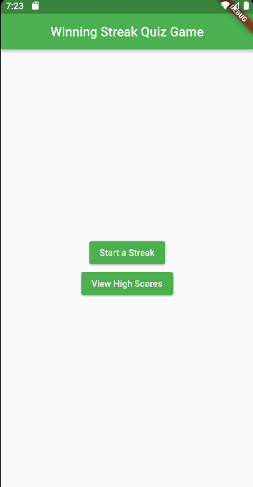
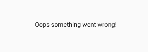
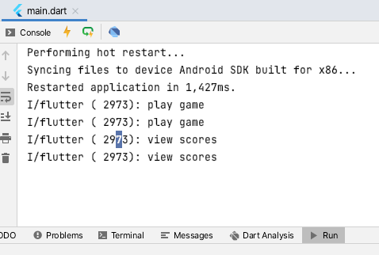
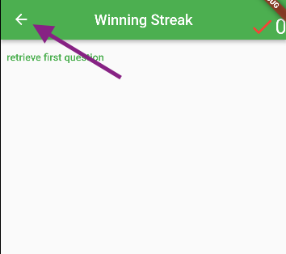
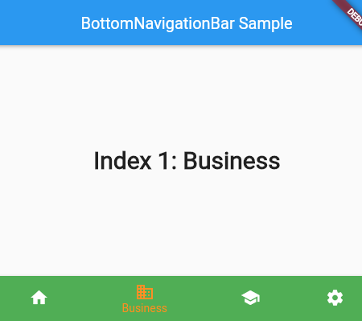
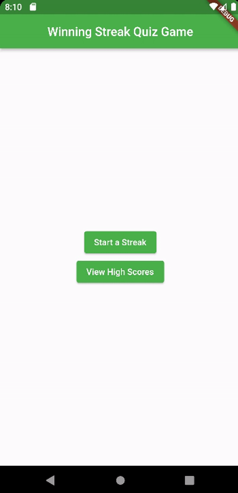

# Lab 6 - Navigating our App

- [ ] Add a landing page
- [ ] 2 buttons - play the game
                 - see the high scores

In this lab we will add navigation and routing to our winning streak app. We will add a *centralized routing approach*. All of our routes will be defined in their own RouteGenerator class. At the moment our app only has one route:  StreakPage, it changes dynamically and allows the game play.

Today we add:

 - [ ] Home Page - an initial landing Page
 - [ ] High Score Page - A bottom navigation page that allows us to look at local high scores or global high scores

## HomePage

Open the `home/home_view.dart` file

You are provided with some starter code that displays an empty Scaffold.

Add two `ElevatedButton` widgets to the `body:` of the Scaffold one with text (you might wrap them in a Center and a Column if you'd like them to migrate away from the upper left)

`Start a Streak` and the other with `View High Scores` for the `onPressed:` named parameter of the ElevatedButton just print out to the console for now:

example `print('start streak clicked')`

A sample HomePage might look like this:



## Route Generator

`routes/route_generator.dart` is where we will define all of our routes.

Open that file and notice some code is already there for you. It will display an Unknown route screen if the page we are routing to isn't matched (although it only does this in debug mode).

at the top of the RouteGenerator class add:

`static const String homePage = '/';`

In order to use the RouteGenerator class we need to make a few adjustments to `app.dart` where our MaterialApp is first launched.

Alter the StreakApp class in `app.dart` to remove the `home:` named parameter and alter the class so it looks like this:

```dart
import 'package:flutter/material.dart';
import 'package:winning_streak_lab06/routes/route_generator.dart';

/// A MaterialApp which sets the `home` to StreakPage.
class StreakApp extends MaterialApp {
   StreakApp({Key? key}) : super(key: key,
      initialRoute:  RouteGenerator.homePage,
      onGenerateRoute: RouteGenerator.generateRoute,
      theme: ThemeData(
          primarySwatch: Colors.green,
          ),
  );
}
```

Notice we add two named parameters to our MaterialApp:

`initialRoute` and `onGenerateRoute`. This tells Flutter to find any required routes in our RouteGenerator class.

**Build and run the app**

Did you see this?:



That's the UnknownScreen that will display in the case that we haven't handled a particular route.

Go back to `routes/route_generator.dart` and add a switch statement to the generateRoutes method that switches on `settings.name` (above the `if(kDebugMode)` ...)

`switch(settings.name) { ... `

Add a case for `homePage`:

```dart
case homePage:
  return MaterialPageRoute(
    builder: (_) => const HomePage(),
  );
```
**Build and run again** (a hot-reload likely won't migrate away from the unknown screen page so you'll need to click the green run arrow)

Do you see your home page?

Click the buttons and see that their output shows up in the run console:



<details><summary>Hint: HomeView with Buttons</summary>
<p>

```dart
//lib/home/home_view.dart

import 'package:flutter/material.dart';
import 'package:winning_streak_lab06/routes/route_generator.dart';

/// Show the home page
class HomeView extends StatelessWidget {
  @override
  Widget build(BuildContext context) {
    return Scaffold(
      appBar: AppBar(
        centerTitle: true,
        title: const Text("Winning Streak Quiz Game"),
      ),
      body: Center(
        child: Column(
          mainAxisAlignment: MainAxisAlignment.center,
          children: <Widget> [
            ElevatedButton(
              child: Text('Start a Streak'),
              onPressed: () => print('play game')
            ),
            ElevatedButton(
            child: Text('View High Scores'),
            onPressed: () => print('view scores'),
            ),
          ],
        ),
      ),
    );
  }
}
```
</p>
</details>
<br>


## Link the Start a Streak button

In RouteGenerator add a route for the StreakPage

1. Add a static const string streakPage:
`static const String streakPage = '/streakGame';`

2. Handle the case in the switch statement of `generateRoutes`

  - should look just like the `HomePage` `MaterialPageRoute` but instead lead to: `StreakPage`

Back in `home/home_view.dart` in the onPressed parameter for the Start a Streak button change this from printing to console to instead use:

```Dart
Navigator.pushNamed(
                context,
                RouteGenerator.streakPage,
              )
```

**build and run the app**

Once a user starts a streak we might not to lead them towards thinking they can go back. So we should remove that implied back button.



Go to `streak/view/streak_view.dart` and add this named parameter to the `Appbar` to remove the automatic back button:

`automaticallyImplyLeading: false,`


**build and run**

Maybe a bit strange that our Start a streak button leads to another button that asks the user to start a streak.

You can make changes to this flow as you see fit.

## High scores

Our app is going to eventually be linked to a cloud database to track the top 10 longest streaks by anyone playing the game.

But it will also track the top 10 longest streaks that happened locally on the app (a user's personal best streaks for instance).

We will use the BottomNavigationBar of a Scaffold to handle the dual high score lists (one option for each view)



When doing this bottom navigation bar we will show either the local high score list or the global high score list.

We have two options to handle the state of the screen:

- a stateful widget
- a state management strategy (e.g. Cubit<bool>)

In this case there is little difference between the two strategies. One potential difference is perhaps if you wanted someone returning to the HighScore page to be placed into the tab that they were in last time then the state management strategy would more easily allow that.

For that reason let's pursue that option. Although you are welcome to do the stateful widget approach outlined in the flutter api BottomNavigationBar api page:

https://api.flutter.dev/flutter/material/BottomNavigationBar-class.html


**Plan** (if you choose to do the Cubit<bool> route)

Add a dart file to the `high_score/cubit` directory: `hs_toggle_cubit.dart`.

(don't use the Add Cubit class option - just an empty file is easier to deal with for simple states).

Populate your file as follows:

```Dart
import 'package:flutter_bloc/flutter_bloc.dart';

class HSToggleCubit extends Cubit<bool> {

  //much easier than trying to remember which is false and which is true
  static const bool LOCAL = false;
  static const bool GLOBAL = true;

  HSToggleCubit(bool initialState) : super(initialState);
  //switch to a new state
  void toggle(bool value) => emit(value);
}
```

Two steps are left to get the bottom nav functioning:

- [ ] inject the Bloc at the right spot
- [ ] use BlocBuilder to build the correct high score page

*More challenging than you might think (where to inject the bloc):*

Option 1:inject the bloc at: `high_score_page`, which seems like the natural spot since the only user of the cubit is the high_score_view.
   - pro: the bloc will always be provided since the page directly creates the view (no chance of a crash because of a missing bloc)
   - con: the cubit will reset to Local high score tab each time we visit the Page
      - our original choice for the cubit was because we wanted someone to come back to the page and see the scoreboard they were on last time.

Option 2: inject the bloc at the top of the program
  - because we will enter the High Score Page via a Navigation call we could end up with the program crashing if we don't inject the widget at the same level as the routing generator.
  - pro: the bloc is provided
  - con: (sort of) the cubit is created far away from where we use it (makes the code less readable / contained?)
  - note: we can't inject it at home page because of the navigator the high score page won't go into the home page widget tree, meaning the bloc won't be provided to the high score page.

Following Option 2 we provide the bloc at the top of the program: `main.dart`

Change `main.dart` to provide the bloc (use a MultiBlocProvider in case in the future we inject other blocs here )

```dart
BlocOverrides.runZoned(
        () => runApp( MultiBlocProvider(
            providers: <BlocProvider>[
                BlocProvider<HSToggleCubit>(
                  create: (_)=>HSToggleCubit(HSToggleCubit.LOCAL),
                ),
              ],
              child: StreakApp(),
        )),
    blocObserver: StreakObserver(),
  );

```

You can leave that BlocOverrides blocObserver in there to continue to monitor state changes in the console.

- [ ] Use BlocBuilder to dynamically update the HighScore view.

Inside `high_score_view.dart` the general principle is to build the block as far down the widget tree as possible. The Scaffold doesn't need the bloc, nor the AppBar but the body does and so does the BottomNavigationBar. Thus we will wrap the contents of the body and the bottom nav bar in the BlocBuilder: then any time the state changes they will rebuild (but the Scaffold and the AppBar won't)

change the body to:

```Dart
body: BlocBuilder<HSToggleCubit, bool>(
      builder: (context, state) {
        if (state == HSToggleCubit.LOCAL) {
          return Text("local high score list");
        }
        else {
          return Text("global high score list");
        }
      }
    ),
```

The BottomNavigationBar is a little more interesting (at the moment since our body is basically empty).

At first glance it might not look like it needs to rebuild on updates but rather just `talk` to the bloc. i.e., call the `toggle` method if someone selects the global choice:

```dart
onTap: (index) => context.read<HSToggleCubit>().toggle(index == global),
```

The first glance is partly correct, however the icons are colored according to which is the active choice and so we have to wrap this in a BlocBuilder to get that update. `currentIndex` is what triggers the coloring:

```dart
currentIndex: state==HSToggleCubit.LOCAL? local:global,
```

Notice I set a couple of const to try to aid readability:

const int local = 0;
const int global = 1;

But:

*Note: you might notice our code is bug prone at the moment. Using bool for the cubit perhaps wasn't the best choice since it doesn't align with the 0 and 1 for the bottom nav bar index. An int cubit would allow for code reuse of the const values in the cubit rather than having to remember 0 will align to false and 1 to true, etc. For now: we'll leave this as something that should be fixed. In an actual project this would be where you would document this in your repository or on a list of pending work items*

- [ ] Wrap the bottomNavigationBar in a BlocBuilder and use `state` to keep `currentIndex` set correctly.
- [ ] onTap can simply access the cubit to call `toggle` (code as noted above).  


## Fix the routing ##

- [ ] add  highScorePage to RouteGenerator
     - add a static const String
     - handle the case in the switch statement

<details><summary>Hint: RouteGenerator</summary>
<p>

```dart
    //near the top:
    static const String highScorePage = '/highScore';

    //in the switch
     case highScorePage:
        return MaterialPageRoute(
          builder: (_) => const HighScorePage(),
        );      
```

</p>
</details> <br>

- [ ] link the button in home_view to call Navigator.pushNamed

<details><summary>Hint: HomeView</summary>
<p>

```dart

//body of Scaffold in home_view.dart
ElevatedButton(
  child: Text('View High Scores'),
  onPressed: () => Navigator.pushNamed(
    context,
    RouteGenerator.highScorePage,
  )
```
</p>
</details> <br>

<details><summary>Hint: high_score_view</summary>
<p>

```dart
//lib/high_score/view/high_score_view.dart

import 'package:flutter/material.dart';
import 'package:flutter_bloc/flutter_bloc.dart';
import 'package:winning_streak_lab06/high_score/cubit/hs_toggle_cubit.dart';

/// Show the high score
class HighScoreView extends StatelessWidget {
  @override
  Widget build(BuildContext context) {
    return Scaffold(
      appBar: AppBar(
        centerTitle: true,
        title: const Text("Winning Streak - High Scores"),
      ),
      body: BlocBuilder<HSToggleCubit, bool>(
          builder: (context, state) {
            if (state == HSToggleCubit.LOCAL) {
              return Text("local high score list");
            }
            else {
              return Text("global high score list");
            }
          }
      ),
      bottomNavigationBar: BlocBuilder<HSToggleCubit, bool> (
        builder: (context, state) {
          const int local = 0;
          const int global = 1;
          return BottomNavigationBar(
            items: const<BottomNavigationBarItem>[
              BottomNavigationBarItem(
                icon: Icon(Icons.bungalow),
                label: 'Local',
              ),
              BottomNavigationBarItem(
                icon: Icon(Icons.location_city),
                label: 'Global',
              ),
            ],
            onTap: (index) => context.read<HSToggleCubit>().toggle(index == global),
            currentIndex: state==HSToggleCubit.LOCAL? local:global,
          );
        }
      ),
    );
  }
}
```
</p>
</details>
<br>

**Build and run the app** Notice your tab will be remembered.


<details><summary>Hint: completed route_generator.dart</summary>
<p>

```dart


import 'package:flutter/foundation.dart';
import 'package:flutter/material.dart';
import 'package:winning_streak_lab06/high_score/view/high_score_page.dart';
import 'package:winning_streak_lab06/home/home_page.dart';
import 'package:winning_streak_lab06/routes/unknown_screen.dart';
import 'package:winning_streak_lab06/streak/streak.dart';

class RouteGenerator {

  static const String homePage = '/';
  static const String streakPage = '/streakGame';
  static const String highScorePage = '/highScore';

  //private constructor
  RouteGenerator._();

  static Route<dynamic> generateRoute(RouteSettings settings) {
    switch (settings.name) {
      case homePage:
        return MaterialPageRoute(
          builder: (_) => const HomePage(),
        );
      case streakPage:
        return MaterialPageRoute(
          builder: (_) => const StreakPage(),
        );
      case highScorePage:
        return MaterialPageRoute(
          builder: (_) => const HighScorePage(),
        );
    }
    if(kDebugMode) {
      return MaterialPageRoute(builder: (context) =>  UnknownScreen());
    }
    else {
      return MaterialPageRoute(builder: (context) => const HomePage());
    }
  }

}

```
</p>
</details>
<br>




**end of lab**

Future Labs:

- [ ] testing our app
- [ ] save the local high scores into a local db on disk (hive database and/or sql-lite)
- [ ] use shared preferences to save user initials (for our high score board)
  - note that once upon a time arcade games had high score lists where a user entered their initials if they made the high score (see for example: https://www.youtube.com/watch?v=L3urawMnPFA)
- [ ] global cloud-connected high score list
- [ ] android intents to share streaks with others (via text)
- [ ] monitoring the global high score board in the background and SnackBar notifications of new global high scores
- [ ] some of the above will be optional skeleton labs to give ideas for where you might uniquely modify your version of the app
