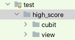
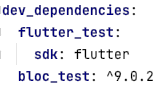
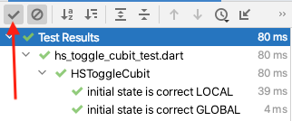

[](https://classroom.github.com/a/xwBd36-c)
# Lab 07 - Testing our Winning Streak App

**clone this repository locally to download the starter code**

We have accumulated so much debt with respect to testing our winning streak app that we will focus on just one component this week since we cannot write all of the required tests in one go. In a real project we would allocate more time to testing our app as we develop them. So we can avoid shipping an un-tested app or having an un-tested mess (like we do now) that we cobble together some tests for as a last step in the development process (not a good strategy).

Today we will test our `HSToggleCubit` that we created last lab along with the `HighScorePage`.

Recall in the last lab there were some notes that the HSToggleCubit and the HighScorePage don't play nicely with one another. For example:
`HSToggleCubit extends Cubit<bool>` but the `BottomNavigationBar` in the `HighScoreView` uses an `int` to track the `currentIndex` and `currentIndex` is how a BottomNavigationBar keeps track of which tab is the active tab (obviously our app has 2 tabs only (global and local) and so we choose a bool to track the state where as a bottom nav bar in general could have many tabs and so an int is most appropriate). Long story short there could easily be a bug at some point in our program because we have a mismatch between bool and int.

(In reality) we can have bugs anywhere and we should be testing all of our components. However this is perhaps relatable and allows us to put into the back of our heads some idea as to why the tests we write today are important.

# Testing Set-up

- [ ]  Add folders to the existing `test` folder:

  - [ ] high_score
  - [ ] inside high_score add:
      - [ ] cubit
      - [ ] view

 

 - [ ] Add `hs_toggle_cubit_test.dart` to the new `test/high_score/cubit` folder

# Unit-test the cubit

- [ ] ensure `bloc_test` is listed under `dev_dependancies` in `pubspec.yaml`
- [ ] add it if necessary (then click: pub get)



There's no mocking required to unit-test our cubit (unit-tests by nature are isolated to the component being tested).

Inside `hs_toggle_cubit_test.dart` create some `basic` tests to ensure things are working correctly:

- [ ] import the appropriate packages:
```dart
import 'package:bloc_test/bloc_test.dart';
import 'package:test/test.dart';
```

place the tests inside a group:

```dart
void main() {

  //toggle cubit tests
  group('HSToggleCubit', () {

```

Grouping the tests allows easier running and identification of just specific tests.

- [ ] Create two basic tests to ensure the `HSToggleCubit` creates the correct state on creation

- the first (of two) tests is given below:

```dart
test('initial state is correct LOCAL', () {
  final toggleCubit = HSToggleCubit(HSToggleCubit.LOCAL);
  expect(toggleCubit.state,HSToggleCubit.LOCAL);
});
```

- [ ] add the matching test for the above (but with `GLOBAL`)


Run the tests by clicking the green arrow next to the test or next to main.

Compile error? Did you import the cubit?
`import 'package:winning_streak_lab06/high_score/cubit/hs_toggle_cubit.dart';`

Don't see the result for each test (just see a summary Tests passed 2 of 2?)

- [ ] Turn on the `passing` tests by click the checkmark (next to the `No` :no_entry_sign: symbol):



Our cubit is pretty simple, since the state is just a bool. If we had a more complex state we'd want a testing file for the states as well to ensure they behave correctly (example: multiple_choice: QuestionState).

- [ ] Create another group (it can be inside the existing group) called 'toggle local / global':

```dart
group( 'toggle local/global', () {
```

Inside this group we will do our `bloc_test`(s).

A bloc_test has a condensed form making these tests easy to write.

Our first test will ensure global is emitted when we call: `cubit.toggle(HSToggleCubit.GLOBAL)`

Add this test to your new group:

```dart
group( 'toggle local/global', () {
  blocTest<HSToggleCubit, bool>(
      'emits Global when toggled local to global',
       build: () => HSToggleCubit(HSToggleCubit.LOCAL),
       act: (cubit) => cubit.toggle(HSToggleCubit.GLOBAL),
       expect: () => <bool> [
        HSToggleCubit.GLOBAL,
       ]
  );
```

`bloc_test` allows us to specify how to build the cubit with `build:` then how to act on the built cubit using `act:` and finally what the expected list of emitted states should be using `expect:`

In the above we build the cubit in the LOCAL state and then call toggle and expect that the GLOBAL state will be emitted. Hopefully you can see some benefits to using static final variables in the HSToggleCubit class to aid readability.

- [ ] Run your tests again and inspect the output.

- [ ] Add some additional tests:

The following test will get you started but you should add a few bloc_tests of your own to ensure you understand how they work.

```dart
blocTest<HSToggleCubit, bool>(
    'emits nothing on same same toggle',
    build: () => HSToggleCubit(HSToggleCubit.GLOBAL),
    act: (cubit) => cubit..toggle(HSToggleCubit.GLOBAL)
                         ..toggle(HSToggleCubit.GLOBAL),
    expect: () => <bool> [
      HSToggleCubit.GLOBAL
      //just one toggle emitted
    ]
);
```

Recall the a cubit won't emit the same state twice - it checks the value being emit to see if it is equal to what was last emitted and if they are the same it won't emit. In our design of the cubit we only emit in the toggle method. Thus in the above example you'll notice only one expects output state.

Build a few other tests to ensure the cubit is functioning correctly.

<details> <summary>Hint: A completed example `hs_toggle_cubit_test.dart` file</summary>
<br>
<p>

```dart
import 'package:bloc_test/bloc_test.dart';
import 'package:test/test.dart';
import 'package:winning_streak_lab07/high_score/cubit/hs_toggle_cubit.dart';

//tests relating to the HSToggleCubit
//no mocking the cubit we test the methods directly on the real cubit
//the state is a simple bool so no corresponding tests relating to the State
void main() {

  group('HSToggleCubit', () {

    test('initial state is correct LOCAL', () {
      final toggleCubit = HSToggleCubit(HSToggleCubit.LOCAL);
      expect(toggleCubit.state,HSToggleCubit.LOCAL);
    });

    test('initial state is correct GLOBAL', () {
      final toggleCubit = HSToggleCubit(HSToggleCubit.GLOBAL);
      expect(toggleCubit.state,HSToggleCubit.GLOBAL);
    });

    group( 'toggle local/global', () {
      blocTest<HSToggleCubit, bool>(
          'emits Global when toggled local to global',
           build: () => HSToggleCubit(HSToggleCubit.LOCAL),
           act: (cubit) => cubit.toggle(HSToggleCubit.GLOBAL),
           expect: () => <bool> [
            HSToggleCubit.GLOBAL,
           ]
      );

      blocTest<HSToggleCubit, bool>(
          'emits local when created local and toggled to local',
          build: () => HSToggleCubit(HSToggleCubit.LOCAL),
          act: (cubit) => cubit.toggle(HSToggleCubit.LOCAL),
          expect: () => <bool> [
            HSToggleCubit.LOCAL,
          ]
      );

      blocTest<HSToggleCubit, bool>(
          'emits Local when toggled global to local',
          build: () => HSToggleCubit(HSToggleCubit.GLOBAL),
          act: (cubit) => cubit.toggle(HSToggleCubit.LOCAL),
          expect: () => <bool> [
            HSToggleCubit.LOCAL,
          ]
      );

      blocTest<HSToggleCubit, bool>(
          'emits nothing on same same toggle',
          build: () => HSToggleCubit(HSToggleCubit.GLOBAL),
          act: (cubit) => cubit..toggle(HSToggleCubit.GLOBAL)
                               ..toggle(HSToggleCubit.GLOBAL),
          expect: () => <bool> [
            HSToggleCubit.GLOBAL
            //just one toggle emitted
          ]
      );

      blocTest<HSToggleCubit, bool>(
          'emits local global local on multi toggles',
          build: () => HSToggleCubit(HSToggleCubit.GLOBAL),
          act: (cubit) => cubit..toggle(HSToggleCubit.LOCAL)
                               ..toggle(HSToggleCubit.GLOBAL)
                               ..toggle(HSToggleCubit.LOCAL)
                               ..toggle(HSToggleCubit.LOCAL),
          expect: () => <bool> [
            HSToggleCubit.LOCAL,
            HSToggleCubit.GLOBAL,
            HSToggleCubit.LOCAL,
          ]
      );

    });//end of 'toggle local/global group

  });


}
```
</p>
<br>
</details>
<br>

- [ ] Run your tests and ensure they all pass

- [ ] Found a bug? Fix the HSToggleCubit class and rerun the code


## Test the HighScorePage

Let's move onto the `HighScorePage` and begin testing it. The `HighScorePage` requires the `HSToggleCubit` (but it doesn't mean we have to have tested the cubit first or even completed the code for it, in order to test the `HighScorePage`) ... We'll mock the cubit so we can isolate the tests to be just the HighScorePage (or widgets within the `HighScorePage`)

This might sound a bit mundane but from a Software Development and Architecture perspective this is a giant leap forward in terms of testing and development process for modern software projects. If you appreciate software development you might be excited to complete this next section of the lab.

- [ ] Add a file: `test/high_score/view/high_score_page_test.dart`

We have to import some files (listed explictly here so people all import the same packages):

- [ ] Add dependencies to this file:

```Dart
import 'package:bloc_test/bloc_test.dart';
import 'package:flutter/material.dart';
import 'package:flutter_bloc/flutter_bloc.dart';
import 'package:flutter_test/flutter_test.dart';
import 'package:mocktail/mocktail.dart';
```

In addition there will be other `local` imports that are required but those shouldn't  have alternative choices.

- [ ] add the dependencies to pubspec.yaml

```yaml
mocktail: ^0.2.0
```

We won't be using the `@GenerateMock` annotation but rather extending our existing class. But if you did generate the mock code you'd need a dev_dependancies (we don't need the below dependency):

```yaml
build_runner: ^2.1.7
```

- [ ] ensure you run `Pub get` for any changes to the pubspec file.


- [ ] Mock the HSToggleCubit in the `high_score_page_test` file just outside of `void main() { }`:

```Dart
// Mock class
class MockHSToggleCubit extends MockCubit<bool> implements HSToggleCubit {}
```

This will create a stubs class: `MockHSToggleCubit` with all of the capabilities. In the notes for the Mocking library they suggest generating the Mock to ensure null safety is mocked properly but in this case we are fine to use the above more simple `extends` method.

Recall a stubs class has all of the methods from the API (and variables) but they contain are empty method bodies. Example our above  MockHSToggleCubit will contain a .toggle method that does nothing. We'll define the methods in the tests as we need them.


**Set up our tests**

```Dart
class MockHSToggleCubit extends MockCubit<bool> implements HSToggleCubit {}

//Test the HighScorePage
void main() {

//tests on the HighScorePage in General
group('HighScorePage', ()
{
  late HSToggleCubit toggleCubit;

  setUp(() {
    //create the MockedCubit
    toggleCubit = MockHSToggleCubit();
  });
```

`setUp` is code that is called before every test. So in this case before every test we'll get a `new` `MockHSToggleCubit` object. This way we don't have to include this code in every test and we don't have to worry about one test impacting another test (all tests should be self-contained).

### First tests

Recall in our code design `HighScorePage` did not much more than create the `HighScoreView`. Test that `HighScoreView` is created when `HighScorePage` is created:

```Dart
testWidgets('renders highscore view', (WidgetTester tester) async {
  //if state is called return LOCAL
  when(() => toggleCubit.state).thenReturn(HSToggleCubit.LOCAL);

  // Build our app and trigger a frame.
  await tester.pumpWidget(
      BlocProvider.value(
        value: toggleCubit,
        child: MaterialApp(home: HighScorePage()),
      )
  );
  //launching HighScorePage should create 1xHighScoreView
  expect(find.byType(HighScoreView), findsOneWidget);
});
```

We use `testWidgets` because our test involves Widgets (most everything in flutter is a Widget). We need to define the `.state` variable for our Mock class because the state is used to construct `HighScoreView`.

We mock it to `return HSToggleCubit.LOCAL` (i.e., false).  

`pumpWidget` is how you build your widgets for testing purposes ... but we need our cubit for HighScorePage/View so we wrap it in a BlocProvider.value and wrap the HighScorePage in an otherwise empty MaterialApp.

Lastly we start small: expect to find in the widget tree 1x HighScoreView Widget.

- [ ] run the test and ensure it passes

- [ ] copy/modify the above test to change the last expect line to

```dart
//finds one navigation bar
expect(find.byType(CustomBottomNavigationBar), findsOneWidget);
```

You might notice to aid testing the code from the BottomNavigationBar has been pulled into its own class called `CustomBottomNavigationBar`.

<details><summary>Hint: second widget test bottom nav bar</summary>
<br><p>

```Dart
testWidgets('renders bottom navigation bar', (WidgetTester tester) async {
  //if state is called return LOCAL
  when(() => toggleCubit.state).thenReturn(HSToggleCubit.LOCAL);

  // Build our app and trigger a frame.
  await tester.pumpWidget(
      BlocProvider.value(
        value: toggleCubit,
        child: MaterialApp(home: HighScorePage()),
      )
  );
  //finds one navigation bar
  expect(find.byType(CustomBottomNavigationBar), findsOneWidget);

});
```
<br></p>
</details>
<br>

You can debate whether it is overkill to separate the above two tests into separate tests or whether it is better to include multiple `expect` lines into one test.

At least we want that if someone gets rid of the BottomNavigationBar or it doesn't render that they'll be signalled by some failing tests that make it clear what is failing and why.

In our 3rd test we combine two `expect` lines into the same test (it's a logical fit here):

```Dart
testWidgets('bottom nav bar has Local and Global', (WidgetTester tester) async {
  //if state is called return LOCAL
  when(() => toggleCubit.state).thenReturn(HSToggleCubit.LOCAL);

  // Build just the bottom nav bar
  await tester.pumpWidget(
      BlocProvider.value(
        value: toggleCubit,
        child: MaterialApp(home: Scaffold(bottomNavigationBar:CustomBottomNavigationBar())),
      )
  );
  //finds one navigation bar
  expect(find.text('Local'), findsOneWidget);
  expect(find.text('Global'), findsOneWidget);
});
```

- **Note** The text in the testWidgets first parameter is the name of the test in your testing report. It is essential to make it somewhat clear what is being tested.

- Those 3 tests should encompass the most basic creation tests for items appearing in the widget tree. With those tests passing we can move onto more complex tests that depend on those things being in the Widget tree.

- [ ] run the tests so far to ensure they pass

## Tests interacting with the cubit state

Next let's write a test to see if the cubit `state` is accessed when the HighScorePage is built:

- [ ] Self-Check: whereas previously we used `expect` to run a test to help validate our test. In this case we want to ensure a particular method or variable is accessed. What do we use in place of expect?

<details> <summary>how to ensure a method is called?</summary>
<br><p>

```Dart
verify
```

</p><br>
</details>

- [ ] Add the following test to verify `.state` is called

```dart
testWidgets('hs view accesses cubit state', (WidgetTester tester) async {
  //if state is called return LOCAL
  when(() => toggleCubit.state).thenReturn(HSToggleCubit.LOCAL);

  // Build our app and trigger a frame.
  await tester.pumpWidget(
      BlocProvider.value(
        value: toggleCubit,
        child: MaterialApp(home: HighScorePage()),
      )
  );
  //calls state
  verify(()=>toggleCubit.state);
});
```


- [ ] Complete the below test to ensure .toggle is called on the toggleCubit

```Dart
testWidgets('verify tapping global=> toggle(GLOBAL)', (WidgetTester tester) async {
      //if state is called return false
      when(() => toggleCubit.state).thenReturn(HSToggleCubit.LOCAL);
      // Build just the bottom nav bar
      await tester.pumpWidget(
          BlocProvider.value(
            value: toggleCubit,
            child: MaterialApp(home: HighScorePage()),
          )
      );
      //tap the global tab
      await tester.tap(find.byIcon(CustomBottomNavigationBar.icon_global));

      //rebuild
      await tester.pump();

      //verify toggle has been called with GLOBAL parameter
    });
```

<details><summary>Hint: methods in verify can be passed their parameters</summary>

```Dart
verify(()=>toggleCubit.toggle(HSToggleCubit.GLOBAL));
```

</details>
<br>

- [ ] use `verifyNever` to repeat the above test but ensure .toggle(HSToggleCubit.LOCAL) has never been called


**Recap so far**

- [ ] We know there is a potential issue with ints and bools
- [ ] We should be gaining confidence after the last two tests that our code will continue to be working properly.
   - Summary:
   - [ ] We verified that state was being accessed when the page was built
   - [ ] We verified that .toggle was being called with HSToggleCubit.GLOBAL when the tab with the `icon_global` was selected (and .toggle(HSToggleCubit.LOCAL) was not being called)
   - We should see the power of using a static final class variable for icon_global and icon_local (now we can change the UI by picking new icons if we want and not risk breaking any tests)

   - [ ] Add tests to ensure that if the icon_local tab is clicked that .toggle is called correctly.

- [ ] run your tests

- [ ] The below test will ensure .toggle is called only once when local tab is selected (we add .called(int) to the end of the `verify` call):

```dart
testWidgets('verify tapping local=> toggle(LOCAL) only once', (WidgetTester tester) async {
  //if state is called return false
  when(() => toggleCubit.state).thenReturn(HSToggleCubit.LOCAL);
  // Build just the bottom nav bar
  await tester.pumpWidget(
      BlocProvider.value(
        value: toggleCubit,
        child: MaterialApp(home: HighScorePage()),
      )
  );
  //tap the global tab
  await tester.tap(find.byIcon(CustomBottomNavigationBar.icon_local));

  //rebuild
  await tester.pump();

  //verify toggle has been called with GLOBAL parameter
  verify(()=>toggleCubit.toggle(HSToggleCubit.LOCAL)).called(1);
});

```

- It might be redundant (we could have checked for just one call on our original tests). But it never hurts in testing to have additional tests that might alter just one thing. It can help narrow down the problem with any issues that might arise in the future.

**One last type of test:**

We've likely covered above all the skills you need to do the testing (except one).

The BottomNavigationBar in our page should have the currentIndex set for the appropriate state. In other words if the page loads with the cubit set to GLOBAL it should have the global icon be green (as determined by currentIndex in the nav bar). And similar if the state is LOCAL. For this test we need to access the and assess the state of the BottomNavigationBar.

We can grab a handle to the BottomNavigationBar like so:

`Element candidate = find.byType(BottomNavigationBar,skipOffstage: true).evaluate().first;
`

findByType will given back a Finder object (that's sort of like a list of all the matches in the widget tree). We can tell it to ignore Widgets that are off screen with the provided skipOffstage parameter.

Next we tell the find to run (it is a lazy function) by calling: evaluate() and then grab the first match by calling first.

In this test we can ensure success by building the BottomNavigationBar by itself (outside of the HighScorePage):

```Dart
testWidgets('bottom nav bar has current index = global', (WidgetTester tester) async {
  //if state is called return GLOBAL
  when(() => toggleCubit.state).thenReturn(HSToggleCubit.GLOBAL);
  // Build just the bottom nav bar
  await tester.pumpWidget(
      BlocProvider.value(
        value: toggleCubit,
        child: MaterialApp(home: Scaffold(bottomNavigationBar:CustomBottomNavigationBar())),
      )
  );

  Element candidate = find.byType(BottomNavigationBar,skipOffstage: true).evaluate().first;

```

- [ ] cast the Element to a BottomNavigationBar:

`final castWidget = candidate.widget as BottomNavigationBar;`

- [ ] reach inside the castWidget and access the currentIndex parameter:

`expect(castWidget.items[castWidget.currentIndex].label, "Global");`

Note that above is an alternative way of saying `expect(castWidget.currentIndex, 1);`

You can debate which is the better way ... or you can make that text "Global" a static final variable in which case the first option becomes the best (IMO). It is potentially problematic to hard code string literals into multiple places in your code. Option 2 above is also problematic because we could move Global to be index zero and that would break test cases as well.

You now have all the tools to fully test the HighScorePage.

- [ ] Add any tests you see fit.


<details><summary>Completed high_score_page_test.dart</summary>
<br>

```dart

import 'package:bloc_test/bloc_test.dart';
import 'package:flutter/material.dart';
import 'package:flutter_bloc/flutter_bloc.dart';
import 'package:flutter_test/flutter_test.dart';
import 'package:mocktail/mocktail.dart';

import 'package:winning_streak_lab07/high_score/cubit/hs_toggle_cubit.dart';
import 'package:winning_streak_lab07/high_score/view/high_score_page.dart';
import 'package:winning_streak_lab07/high_score/view/high_score_view.dart';

// Mock class
class MockHSToggleCubit extends MockCubit<bool> implements HSToggleCubit {}

//Test the HighScorePage
void main() {

  //tests on the HighScorePage in General
  group('HighScorePage', ()
  {
    late HSToggleCubit toggleCubit;

    setUp(() {
      //create the MockedCubit
      toggleCubit = MockHSToggleCubit();
    });

    testWidgets('renders highscore view', (WidgetTester tester) async {
      //if state is called return LOCAL
      when(() => toggleCubit.state).thenReturn(HSToggleCubit.LOCAL);

      // Build our app and trigger a frame.
      await tester.pumpWidget(
          BlocProvider.value(
            value: toggleCubit,
            child: MaterialApp(home: HighScorePage()),
          )
      );
      //launching HighScorePage should create 1xHighScoreView
      expect(find.byType(HighScoreView), findsOneWidget);
    });

    testWidgets('renders bottom navigation bar', (WidgetTester tester) async {
      //if state is called return LOCAL
      when(() => toggleCubit.state).thenReturn(HSToggleCubit.LOCAL);

      // Build our app and trigger a frame.
      await tester.pumpWidget(
          BlocProvider.value(
            value: toggleCubit,
            child: MaterialApp(home: HighScorePage()),
          )
      );
      //finds one navigation bar
      expect(find.byType(CustomBottomNavigationBar), findsOneWidget);

    });

    testWidgets('bottom nav bar has Local and Global', (WidgetTester tester) async {
      //if state is called return LOCAL
      when(() => toggleCubit.state).thenReturn(HSToggleCubit.LOCAL);

      // Build just the bottom nav bar
      await tester.pumpWidget(
          BlocProvider.value(
            value: toggleCubit,
            child: MaterialApp(home: Scaffold(bottomNavigationBar:CustomBottomNavigationBar())),
          )
      );
      //finds one navigation bar
      expect(find.text('Local'), findsOneWidget);
      expect(find.text('Global'), findsOneWidget);
    });

    testWidgets('hs view accesses cubit state', (WidgetTester tester) async {
      //if state is called return LOCAL
      when(() => toggleCubit.state).thenReturn(HSToggleCubit.LOCAL);

      // Build our app and trigger a frame.
      await tester.pumpWidget(
          BlocProvider.value(
            value: toggleCubit,
            child: MaterialApp(home: HighScorePage()),
          )
      );
      //calls state
      verify(()=>toggleCubit.state);
    });

    testWidgets('bottom nav bar has current index = local', (WidgetTester tester) async {
      //if state is called return LOCAL
      when(() => toggleCubit.state).thenReturn(HSToggleCubit.LOCAL);
      // Build just the bottom nav bar
      await tester.pumpWidget(
          BlocProvider.value(
            value: toggleCubit,
            child: MaterialApp(home: Scaffold(bottomNavigationBar:CustomBottomNavigationBar())),
          )
      );

      Element candidate = find.byType(BottomNavigationBar,skipOffstage: true).evaluate().first;
      final castWidget = candidate.widget as BottomNavigationBar;
      expect(castWidget.items[castWidget.currentIndex].label, "Local");
    });


    testWidgets('bottom nav bar has current index = global', (WidgetTester tester) async {
      //if state is called return GLOBAL
      when(() => toggleCubit.state).thenReturn(HSToggleCubit.GLOBAL);
      // Build just the bottom nav bar
      await tester.pumpWidget(
          BlocProvider.value(
            value: toggleCubit,
            child: MaterialApp(home: Scaffold(bottomNavigationBar:CustomBottomNavigationBar())),
          )
      );

      Element candidate = find.byType(BottomNavigationBar,skipOffstage: true).evaluate().first;

      final castWidget = candidate.widget as BottomNavigationBar;
      expect(castWidget.items[castWidget.currentIndex].label, "Global");
    });

    testWidgets('bottom nav has current index = LOCAL', (WidgetTester tester) async {
      //if state is called return false
      when(() => toggleCubit.state).thenReturn(HSToggleCubit.LOCAL);
      // Build just the bottom nav bar
      await tester.pumpWidget(
          BlocProvider.value(
            value: toggleCubit,
            child: MaterialApp(home: Scaffold(bottomNavigationBar:CustomBottomNavigationBar())),
          )
      );

      Element candidate = find.byType(BottomNavigationBar,skipOffstage: true).evaluate().first;
      final castWidget = candidate.widget as BottomNavigationBar;
      expect(castWidget.items[castWidget.currentIndex].label, "Local");
    });

    testWidgets('verify tapping global=> toggle(GLOBAL)', (WidgetTester tester) async {
      //if state is called return false
      when(() => toggleCubit.state).thenReturn(HSToggleCubit.LOCAL);
      // Build just the bottom nav bar
      await tester.pumpWidget(
          BlocProvider.value(
            value: toggleCubit,
            child: MaterialApp(home: HighScorePage()),
          )
      );
      //tap the global tab
      await tester.tap(find.byIcon(CustomBottomNavigationBar.icon_global));

      //rebuild
      await tester.pump();

      //verify toggle has been called with GLOBAL parameter
      verify(()=>toggleCubit.toggle(HSToggleCubit.GLOBAL));

    });

    testWidgets('verify tapping global=> toggle(GLOBAL) only once',
                (WidgetTester tester) async {
      //if state is called return LOCAL
      when(() => toggleCubit.state).thenReturn(HSToggleCubit.LOCAL);
      // Build just the bottom nav bar
      await tester.pumpWidget(
          BlocProvider.value(
            value: toggleCubit,
            child: MaterialApp(home: HighScorePage()),
          )
      );
      //tap the global tab
      await tester.tap(find.byIcon(CustomBottomNavigationBar.icon_global));

      //rebuild
      await tester.pump();
      //verify toggle has been called with GLOBAL parameter
      verify(()=>toggleCubit.toggle(HSToggleCubit.GLOBAL)).called(1);
    });

    testWidgets('verify tapping global=> toggle(LOCAL) not called', (WidgetTester tester) async {
      //if state is called return false
      when(() => toggleCubit.state).thenReturn(HSToggleCubit.LOCAL);
      // Build just the bottom nav bar
      await tester.pumpWidget(
          BlocProvider.value(
            value: toggleCubit,
            child: MaterialApp(home: HighScorePage()),
          )
      );
      //tap the global tab
      await tester.tap(find.byIcon(CustomBottomNavigationBar.icon_global));

      //rebuild
      await tester.pump();

      //verify toggle has NEVER been called with LOCAL
      verifyNever(()=>toggleCubit.toggle(HSToggleCubit.LOCAL));

    });

    testWidgets('verify tapping local=> toggle(LOCAL) only once', (WidgetTester tester) async {
      //if state is called return false
      when(() => toggleCubit.state).thenReturn(HSToggleCubit.LOCAL);
      // Build just the bottom nav bar
      await tester.pumpWidget(
          BlocProvider.value(
            value: toggleCubit,
            child: MaterialApp(home: HighScorePage()),
          )
      );
      //tap the global tab
      await tester.tap(find.byIcon(CustomBottomNavigationBar.icon_local));

      //rebuild
      await tester.pump();

      //verify toggle has been called with GLOBAL parameter
      verify(()=>toggleCubit.toggle(HSToggleCubit.LOCAL)).called(1);
    });


    testWidgets('verify tapping local=> toggle(GLOBAL) NEVER', (WidgetTester tester) async {
      //if state is called return false
      when(() => toggleCubit.state).thenReturn(HSToggleCubit.LOCAL);
      // Build just the bottom nav bar
      await tester.pumpWidget(
          BlocProvider.value(
            value: toggleCubit,
            child: MaterialApp(home: HighScorePage()),
          )
      );
      //tap the global tab
      await tester.tap(find.byIcon(CustomBottomNavigationBar.icon_local));

      //rebuild
      await tester.pump();

      //verify toggle has been called with GLOBAL parameter
      verifyNever(()=>toggleCubit.toggle(HSToggleCubit.GLOBAL));

    });
  });//end of group HighScorePage

}

```

</details>

<br><br>

**Congratulations** you have
- unit-tested the `HSToggleCubit`
- unit-tested the `HighScorePage`
- Mocked the `HSToggleCubit`
- integration tested the `HighScorePage` against the Mocked cubit
- and ... completed Lab 07


Looking for ways to modify the app?

- Add testing for the other classes/widgets/cubits
- Mock the Question cubit (a bigger challenge than the toggle cubit)
- test the question state classes
