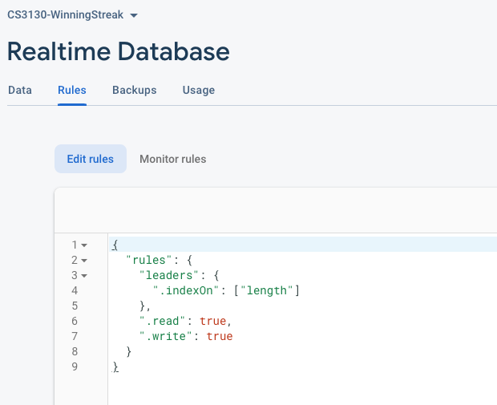

# Lab 10

Adding the Firebase real-time database to your app.

There are a few prerequisites before we get to writing code. The official documentation gives the steps to follow to prepare your app for

## prerequisites:

1. Follow the steps here to add Firebase to the Winning Streak App:

https://firebase.google.com/docs/flutter/setup?platform=android


2. Add the Firebase real-time database to your project.

https://firebase.flutter.dev/docs/database/start

You can leave the database in test mode for now if you like. Or turn read and write to true in your security rules (just for this lab). We'll add additionally security in the next lab. Note: It generally isn't a good idea to leave your database unsecured - other people could use your database or delete your data, etc.

3. Follow these steps to initialize Flutter Fire for use in your app:
https://firebase.flutter.dev/docs/overview

Firebase command line interface that you execute in the last step will add a firebase_options.dart file to your project.

Note for step 3 above I had to modify the minSDK level in app/build.gradle:

```
minSdkVersion 19//flutter.minSdkVersion
```

That change was left in this repository so you shouldn't have to adjust it but beware typically the minSDKVersion is populated from where you installed your flutter sdk and not hardcoded as 19.

After completing the above steps proceed to

# Code the Global High Score list


In `main.dart` ensure that Firebase is initialized: name should match your project name from the firebase console.

```dart
void main() async {

  await LocalHighScoreDatabase.init();
  WidgetsFlutterBinding.ensureInitialized();
  await Firebase.initializeApp(
    name: 'cs3130-winningstreak',
    options: DefaultFirebaseOptions.currentPlatform,
  );

//.... adjustments coming to the BlocProviders later
```

You might have to ensure you have the proper imports that should include:

```dart
import 'package:firebase_core/firebase_core.dart';
import 'firebase_options.dart';
```

**code the global high score database**

add a file: `high_score/database/global_high_score_database.dart`

Our database is simple it will be a flat database with all the high scores stored under the 'leaders' document.

The real-time database looks essentially like a json file. You can store key : value mappings, which can be nested.

Our real-time database will contain data that looks like this:

```json
{
  "leaders" : [
    autokey1: {
      "length" : 5,
      "initials" : "ABC",
      "date" : 50034234,
    },
    autokey2: {
      "length" : 5,
      "initials" : "ABC",
      "date" : 50034234,
    },
  ]
}
```

The database is just a list of the fields for a high score record contained within the "leaders" heading.

Initial code for `global_high_score_database`, some constants and the constructor:

```dart
import 'dart:async';
import 'package:firebase_database/firebase_database.dart';
import '../model/high_score_record.dart';

class GlobalHighScoreDatabase {

  //the real-time database
  late final DatabaseReference ref;

  static const String _leaders = "leaders";

  static const String lengthField = "length";
  static const String initialsField = "initials";
  static const String dateField = "date";

  //pass this in the constructor to allow for future testing / mocking
  GlobalHighScoreDatabase({ref} ) : this.ref=ref??FirebaseDatabase.instance.ref(_leaders);

```

The easiest method to write is the one that adds data into the database. You can add new data to a list within your real-time database using `push` and then `set`. `set` is the typical way to add data but by first getting a reference to a list in the dataset using `push`, then the call to `set` will append the new data to a list using an internal key.  

Then within `set` we specify our key:value pairs in a map. The code will look like this to add a HighScoreRecord to the database:

```dart
//add a high score record to the database
void put(HighScoreRecord highScoreRecord) {
  //append to a list
  //follows from example at:
  //https://firebase.flutter.dev/docs/database/lists-of-data
  DatabaseReference leadersList = ref.push();
  leadersList.set( {
    lengthField : highScoreRecord.length,
    initialsField : highScoreRecord.name,
    dateField : highScoreRecord.date.millisecondsSinceEpoch
  });
}
```

In our `get` method of our `GlobalHighScoreDatabase` we want to retrieve only the top 10 high scores. We can limit a query to the real-time data base to sort our data and retrieve just the last 10. `orderByChild(lengthField)` will sort ascending on the length field from any children in our leaders list. Then `limitToLast(10)` will restrict that to just the last 10:

```dart
//retrieve high scores from our database
Future<List<HighScoreRecord>> get() async {
  final highScores = <HighScoreRecord>[];
  //top 10 leaders
  final topLeaders = await ref.orderByChild(lengthField)
      .limitToLast(10).get();
  if (topLeaders.exists) {
    for (final highScore in topLeaders.children) {

      final hsMap = highScore.value as Map<dynamic, dynamic>;
      highScores.insert(0,HighScoreRecord.fromMap(hsMap));
    }
  }
  return highScores;
}
```

I've added a helper method to HighScoreRecord to help parse the json Map that comes out of the database back into a HighScoreRecord object.

Note also that we call `highScores.insert(0, ...)` to reverse the high score list into descending order as we insert the elements (this might not be the most efficient way to reverse a list).

That covers our database (for now). Later we add a `StreamSubscription` so that our HighScoreLists can auto update. At the moment `.get` will have to be called to retrieve new high scores (and all 10 will be returned everytime).

**code the global high score cubit**

We'll have a Cubit and a State to talk to our global database and help keep any ui elements up to date. The state is exactly the same as our previous HighScoreState - it is provided for you in `global_high_score_state.dart`.

Let's look at the cubit .. the header is provided for you since this class is intertwined with the state.

file: `high_score/cubit/global_high_score_cubit.dart`

Add a reference to the database and add a simple constructor:

```dart
GlobalHighScoreDatabase db;

  GlobalHighScoreCubit(this.db) : super(GlobalHighScoreState()) {
    fetchHighScores();
  }
```

Now we have to build the  method: `fetchHighScores` to retrieve high scores from our new GlobalDatabase.

```dart
Future<void> fetchHighScores() async {
  emit(state.copyWith(status:HSStatus.loading));
    //get the high scores
  List<HighScoreRecord> highScores = await db.get();
  emit(state.copyWith(status:HSStatus.loaded, leaderboard: highScores));
}
```

Recall: the copyWith method constructs a copy of the state with the newly provided data. States should be immutable and so we combine new data with that from the old state and produce a new object. We emit this new state.

You could build and run everything at this point.

Nothing should look different in the app. We need to do 4 things to make the app work:

1. add items to the leaderboard (via the cubit).
2. provide the cubit to the widget tree
3. Update the HighScoreView so that it shows the global high scores
4. submit new high scores when a streak ends

**add items to the leaderboard**

still in the cubit: `high_score/cubit/global_high_score_cubit.dart`

```dart
//send this score onto the database
//don't bother submitting anything that can't possibly be a high score
void submitPossibleHighScore(String initials, int streakLength, DateTime when) {
  print("submit high score");
  HighScoreRecord candidate = HighScoreRecord(initials, streakLength, when);

  if (state.leaderboard.length < 10) {
    db.put(candidate);
  }
  else {
    HighScoreRecord min = state.leaderboard.reduce((a,b)=>a.compareTo(b)<0?a:b);
    //is the min bigger than the candidate
    bool hs = min.compareTo(candidate) > 0 || state.leaderboard.length<10;
    if(hs) {
      db.put(candidate);
    }
  }

}
```

We don't bother sending data to the datebase unless it is at least top 10 in our current state of top 10 scores (although the database might have even larger high scores).

Now we have all the parts of the cubit in place.

**provide the cubit in the widget tree**

alter the `MultiBlocProvider` in `main.dart` to add another cubit:

```dart
BlocProvider<GlobalHighScoreCubit>(
  create: (_)=>GlobalHighScoreCubit(GlobalHighScoreDatabase()),
),
```

**update the HighScoreView**

file: `high_score/view/high_score_view.dart`

at the top line of the build method ensure we call out to fetchHighScores:

`context.read<GlobalHighScoreCubit>().fetchHighScores();`

(just before `return Scaffold`)

then in the else clause of the build method the else related to:
`if (state == HSToggleCubit.LOCAL) {` in other words when `HSToggleCubit.GLOBAL` is set (around line 74) build the global high score list using a BlocBuilder:

```dart
else {
  return BlocBuilder<GlobalHighScoreCubit, GlobalHighScoreState>(
      builder: (context, leaderBoardState) {
        if (leaderBoardState.leaderboard.isEmpty) {
          return Text("no high scores yet");
        }
        else {
          return ListView.builder(
              itemCount: leaderBoardState.leaderboard.length,
              itemBuilder: (context, index) {
                HighScoreRecord hsr = leaderBoardState
                    .leaderboard[index];
                return Card(
                    child: Padding(
                        padding: const EdgeInsets.all((20.0)),
                        child: ListTile(
                          leading: Icon(Icons.star),
                          title: Center(
                            child: Text(
                                "${hsr.name}: ${hsr.length}, ${months[hsr.date.month]} ${hsr.date
                                    .day}"),
                          ),
                          trailing: Icon(Icons.star),
                        )
                    )
                );
              }
          );
        }
      }
  );


```

Because our state is essentially the same as the local high scores, this code is almost identical to our local tab. (there is certainly an opportunity to refactor this solution into a re-useable widget).

Last thing before we can see the results:

**submit high scores after a streak ends**

file: `multiple_choice_question/view/mcq_view.dart`

inside the `else if (state is QuestionAnswered) clause` around line 90 submit the streak to our GlobalHighScoreCubit:

```dart
context.read<GlobalHighScoreCubit>().submitPossibleHighScore("ABC", streak, DateTime.now());
```

Notice in the above the initials are always set to ABC. I'll leave this to you, but as mentioned previously improving this would make a nice improvement to the app.

**run the app and see if everything is working**


At the moment in our design we need to call `fetchHighScores` anytime we want to load our global high score data from the database into the cubit. It will download 10 entries from our real-time database. The HighScoreView doesn't update dynamically and its a little dated to do things this way.

So let's improve things to take advantage of capabilities of the real-time database. We'll use a StreamSubscription to allow updates to the database to automatically flow into our cubit. Thus when you are on the global high score view it will automatically update if some other user sets a new high score (for example).


**update the db and the cubit to support a subscription**

A few steps to get our GlobalHighScores automatically syncing with the database.

1. update the global database to add a subscibe method
2. update the cubit to use the subscription and not use the fetch method
3. update the HighScoreView to stop calling .fetch on our GlobalHighScoreCubit


- [ ] 1. update the global database:

file: `high_score/database/global_high_score_database.dart`

```dart
StreamSubscription subscribe( Function(DatabaseEvent event) fn   ) {
  return ref.orderByChild(lengthField)
      .limitToLast(10).onChildAdded.listen(fn);
}
```

`.listen` allows us to listen for new entries into the "leaders" list on our database.

- [ ] 2. update the cubit to use the subscription

add the following instance field and constructor updates plus one new method first:

```dart
late StreamSubscription subscription;

GlobalHighScoreCubit(this.db) : super(GlobalHighScoreState()) {
  //fetchHighScores();
  subscription = db.subscribe(_processEvent);
}

void _processEvent(DatabaseEvent event){
  final hsMap =  event.snapshot.value as Map<dynamic, dynamic>;
  print(hsMap);
  HighScoreRecord hsr = HighScoreRecord.fromMap( hsMap);
  print(hsr.length);
  addToScoreboard(hsr);
}
```
Now our cubit subscribes to updates from our database when it new entries occur.

Add an addToScoreboard method to push the new leaderboard entries into the state:

```dart
//update the leaderboard
void addToScoreboard(HighScoreRecord highScoreRecord) {
  List<HighScoreRecord> leaders = <HighScoreRecord>[highScoreRecord];
  leaders.addAll(state.leaderboard);
  leaders.sort((a,b)=>b.compareTo(a));
  if(leaders.length > 10) {
    leaders = leaders.sublist(0, 10);
  }
  emit(state.copyWith(status:HSStatus.loaded, leaderboard: leaders));
}
```

- [ ] 3. Get rid of any remaining calls to fetchHighScores

remove this line from `high_score_view.dart`:

`context.read<GlobalHighScoreCubit>().fetchHighScores();`

updates are automatic now. No need to `refresh` the cubit. We have further decoupled the UI from trying to manage the state!


**run the app**

Find someone with an Android device - get them the app (use the AppTester we talked about in class or plug their device into your machine and deploy the app). Watch on the emulator global high score screen while they play the game (or vice versa). If you did everything correct - leaderboard updates are now automatic.

**add indexing to your real-time database**

Navigate to the real-time database console:

https://console.firebase.google.com/



Update the rules to index your database on the `length` field of the children. This will speed up your queries which are trying to retrieve just the top high scores from this database.

```json
{
  "rules": {
    "leaders": {
      ".indexOn": ["length"]
    },
    ".read": true,
    ".write": true
  }
}
```


**use a BlocListener to show a snackbar on new global high scores**

At this point it is fairly easy to show a message to the user when they are in the middle of a streak to let them know some other user has just set a new global high score.

I'll leave this task to you but you can use a `BlocListener` in the StreakView class to show the `Snackbar` whenever the GlobalHighScoreState updates (i.e., a new high score is emitted).

It could make a nice addition to the app.


**congrats**
You have completed lab 10.

Reminder your database is currently open to anyone. You can flip those real-time database rules to false for read and write to lock down your storage (and disable the app) at any point. On Friday we'll fix this security issue.
