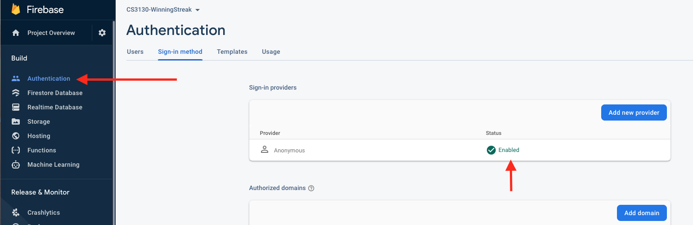
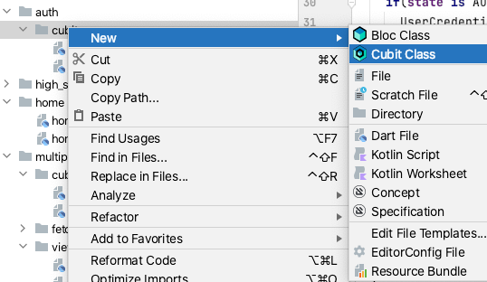

# Lab 11

Firebase makes authentication easy. This labs adds anonymous authentication to our Winning Streak App. This allows us to identify users when they open the app.

Anonymous authentication is not associated with an email or password, it just allows us to identify that the same device/app combo is using the app. It's a good thing for our quiz game app since users might not see why they have to give us an email or other means of sign-up.


# prerequisites:

Your app had to have the firebase console activated (has to be a Firebase project already - Lab 10)

**copy your firebase_options.dart file into this project**


# Activate Firebase anonymous signin

On console.firebase.google.com within your winning streak project click the Authentication sidebar and activate anonymous signin.



Add the firebase_auth dependency to your android studio project:

https://firebase.flutter.dev/docs/auth/overview

**get the instance.

Now anywhere in your app you can access the Firebase Authentication instance using:
`FirebaseAuth auth = FirebaseAuth.instance`
(with: `import import 'package:firebase_auth/firebase_auth.dart';`

# Create a cubit/state to keep track of our user's anonymous sign-in status

Notice there is a new folder `auth` with a folder called `cubit` contained inside. Right click the `auth/cubit` folder and `New->Cubit class`

Give the name `authorization` and add `Equatable`.

This should create an `authorization_state.dart` and `authorization_cubit.dart` class.



# authorization state

Alter the state file so that it contains a signed out state and signed in state:

```dart
part of 'authorization_cubit.dart';

abstract class AuthorizationState extends Equatable {
  const AuthorizationState();
}

class AuthorizationSignedOut extends AuthorizationState {
  @override
  List<Object> get props => [];
}

class AuthorizationSignedIn extends AuthorizationState {

  @override
  List<Object> get props => [];
}
```

# authorization cubit


Add a _subscribe and signin method to the cubit.


```dart
import 'dart:math';
import 'package:bloc/bloc.dart';
import 'package:equatable/equatable.dart';
import 'package:firebase_auth/firebase_auth.dart';

part 'authorization_state.dart';

class AuthorizationCubit extends Cubit<AuthorizationState> {
  AuthorizationCubit() : super(AuthorizationSignedOut()) {
    _subscribe();
  }

  Future<void> _subscribe() async {
    FirebaseAuth.instance
        .authStateChanges()
        .listen((User? user) async {
      if (user == null) {
        print("signed out");
        emit(AuthorizationSignedOut());
        await signIn();
      }
      else {
        print("user is signed in");
      }
    });
  }

  Future<void> signIn() async {
    if(state is AuthorizationSignedOut) {
      UserCredential userCredential = await FirebaseAuth.instance
          .signInAnonymously();

      print("user: ${userCredential.user}");
      emit(AuthorizationSignedIn());
    }
  }
```

In the above design we have to explicitely call signIn to sign a user into our anonymous system.

That's pretty much it, we have added the ability to anonymously signin users for our app.

## sign in users

Provide the AuthenticationCubit to the StreakView:

file: `streak/view/streak_page.dart`:

Add this to the MultiBlocProvider:

```dart
BlocProvider<AuthorizationCubit>(
  create: (_) => AuthorizationCubit(),
)
```

In `multiple_choice_question/view/mcq_view.dart` sign the user in:

```dart
//...
class MCQView extends StatelessWidget {

  @override
  Widget build(BuildContext context) {

    if(context.read<AuthorizationCubit>().state is AuthorizationSignedOut) {
      context.read<AuthorizationCubit>().signIn();
    }

    return BlocBuilder<QuestionCubit, QuestionState>(
      //...
```

Then near to line 77 alter the code to look like this:

```dart
if(!streakEnded) {
  context.read<StreakCubit>().increment();
}
else { //streak is over
  int streak = context.read<StreakCubit>().state;

  if(context.read<AuthorizationCubit>().state is AuthorizationSignedIn) {
    print("user is signed in check for high score");
    context.read<GlobalHighScoreCubit>().submitPossibleHighScore("ABC", streak, DateTime.now());
  }
  if(context.read<LocalHighScoreCubit>().isHighScore(streak, DateTime.now())) {

    //might be a good spot for a dialog to get initials?
    print("new high score!");

    //save the streak as a high score
    var r = Random();
    String rando = String.fromCharCode(r.nextInt(26)+65) + String.fromCharCode(r.nextInt(26)+65) + String.fromCharCode(r.nextInt(26)+65);
    context.read<LocalHighScoreCubit>().updateScoreboard(streak, DateTime.now(), rando);
  }
  context.read<StreakCubit>().reset();
}
```

Now this will only submit high scores to firebase for logged in users.

**run the program**

It might be getting tough to manually verify the scoreboard since everyone's initials are `ABC`. Plus you'll have to play the game and achieve a high score first.

## Add security to the Firebase database so that only authorized users can write to the high score board database.

Head to the Firebase Console and under Real-time database and rules edit so that writes are only allowed if `auth != null` (the user is signed in)

```
{
  "rules": {
    "leaders": {
      ".indexOn": ["length"]
    },
    ".read": true,
    ".write": "auth != null"
  }
}
```

**stop the app first then run it again (we need to stop to force a sign out)**

- verify you can still write to the high score board

- modify the app to not sign anyone in:

set the default state to AuthenticationSignedIn and it will never proceed to call signInAnonymously on the FirebaseAuth:

file `auth/cubit/authorization_cubit.dart`:

```dart
class AuthorizationCubit extends Cubit<AuthorizationState> {
  AuthorizationCubit() : super(AuthorizationSignedIn()) { //change the out to in here for testing

```

- run the app and play the game and try to get a high score

- (after some time period ~30 minutes) you'll be able to check on the Firebase Console under the Real-time database and rules then Monitor to see that you are now denied from writing to the data base.

-For now verify that your new data doesn't show up in the high score data base (or app's global leaderboard)
  - you could also access the failed write from the database where the .set is called. (that is left to you if you like).

- Undo your changes above (default signin state is `AuthorizationSignedOut`) and stop then re-run the app and verify everything is working again.


## Add some random initials to the user's displayName

Each user in Firebase authentication has a profile containing common profile fields (email, display name, etc). We can store initials into the display name so we can verify that anonymous signin gives the same

Rather than have everyone using ABC alter the initials to be a random string that is stored in the user's anonymous account on Firebase.

**add two methods to the cubit**

file: `auth/cubit/authorization_cubit.dart`:

```dart

Future<void> setInitialsIfUnset(String initials) async {
    User? user = FirebaseAuth.instance.currentUser;
    if (user!= null && user.displayName != null) {
      await user.updateDisplayName(initials);

    }
  }

  String _genRandomString() {
    Random r = Random();
    return String.fromCharCode(r.nextInt(26)+65) + String.fromCharCode(r.nextInt(26)+65) + String.fromCharCode(r.nextInt(26)+65);
  }
```

Notice in the above that we call updateDisplayName to change the data for the user (even though they are anonymous).

**update the `AuthorizationSignedInState`:**

```dart
class AuthorizationSignedIn extends AuthorizationState {
  String initials;
  AuthorizationSignedIn({initials}) : this.initials = initials??"ABC";

  @override
  List<Object> get props => [initials];
  }

```

Now we can supply initials to the state when the user signs in.

alter the signIn method in the AuthorizationCubit:

```dart
Future<void> signIn() async {
    if(state is AuthorizationSignedOut) {
      UserCredential userCredential = await FirebaseAuth.instance
          .signInAnonymously();
      String initials = _genRandomString();
      if (userCredential.user != null &&
          userCredential.user?.displayName == null) {
        await setInitialsIfUnset(initials);
      }
      else if (userCredential.user != null) {
        initials = userCredential.user?.displayName ?? initials;
      }
      print("user: ${userCredential.user}");
      emit(AuthorizationSignedIn(initials: initials));
    }
  }
```

**lastly, use the initials in mcq_view.dart**

near to line 82 use the .initials from the state:

```dart
if(context.read<AuthorizationCubit>().state is AuthorizationSignedIn) {
    var auth =  context.read<AuthorizationCubit>().state as AuthorizationSignedIn;
    context.read<GlobalHighScoreCubit>().submitPossibleHighScore(auth.initials, streak, DateTime.now());
  }
```


**congrats you have finished lab 11**

Play the game a few times, close the app re-open it and verify that you get the same initials each time.

*Note: a bug was fixed in `global_high_score_cubit.dart`* So if you are continuing with a prior lab you'll need to fix the min.compareTo line in `global_high_score_cubit.dart` to flip > to <
